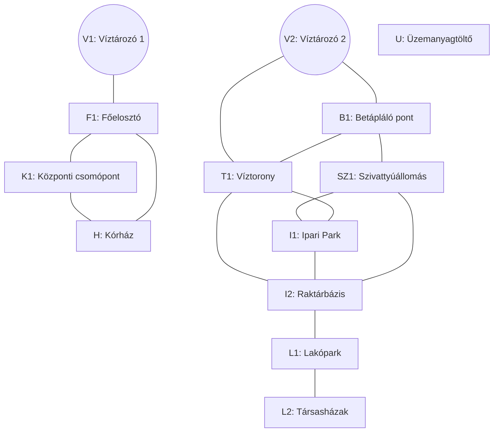
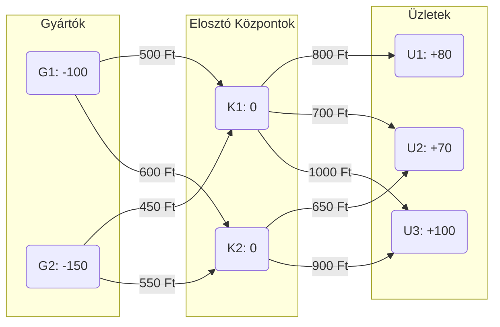
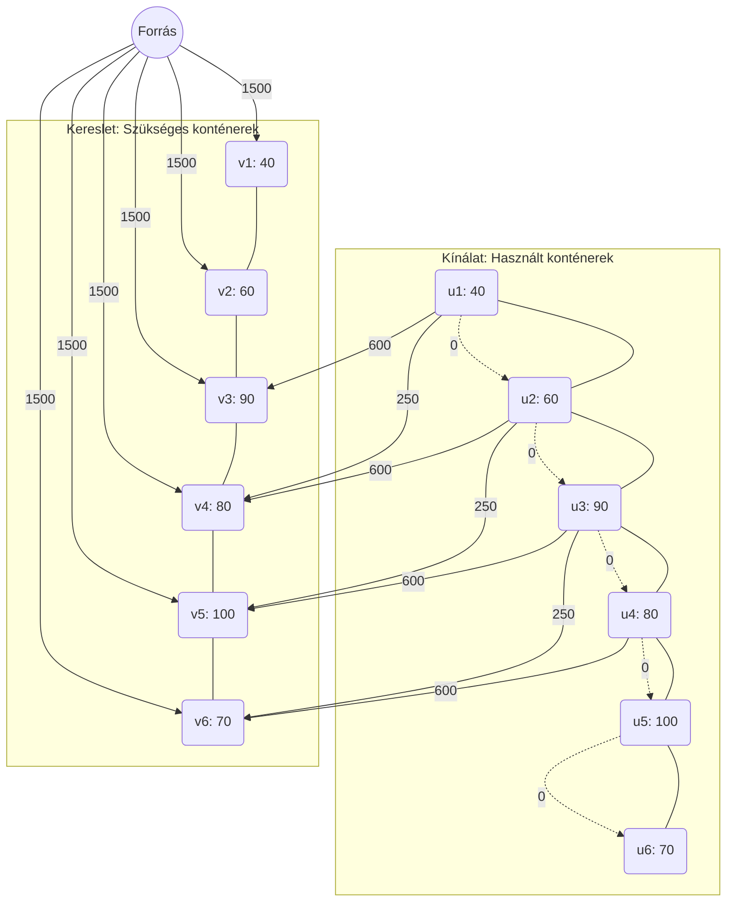
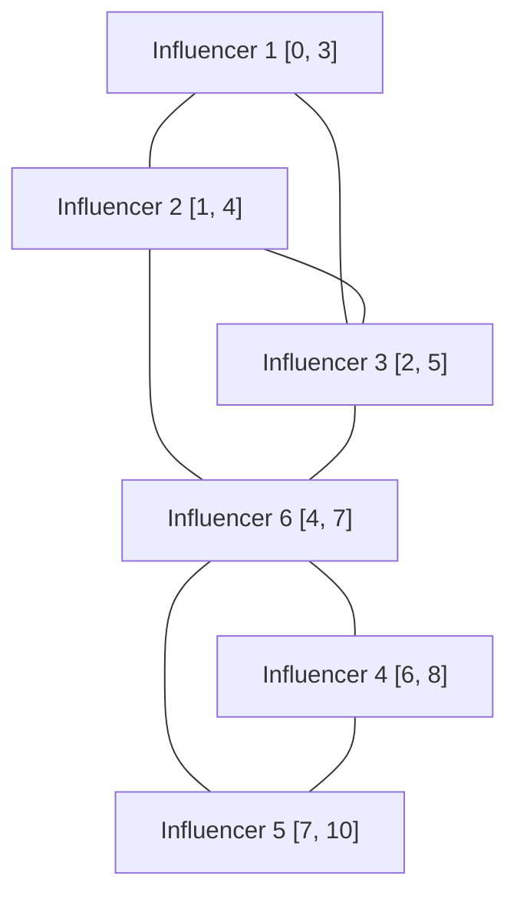
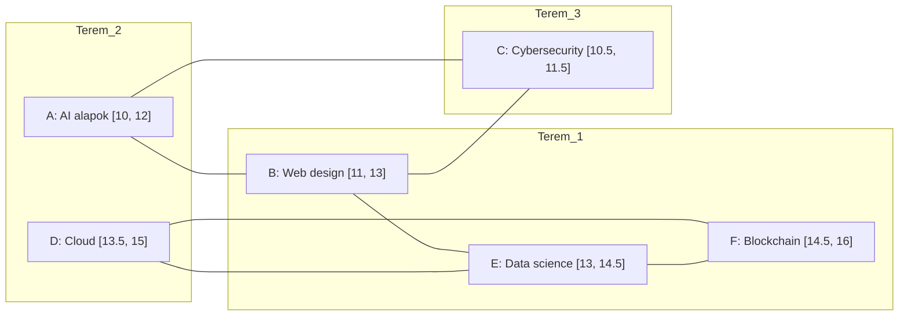
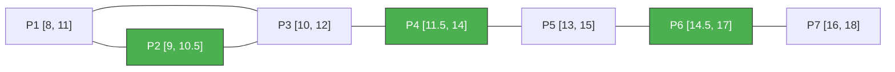

# Gráfelméleti algoritmusok

## Alapfogalmak és definíciók

Egy $G$ gráfot a $G = (V, E, I)$ rendezett hármassal definiálunk:

- **$V(G)$**: csúcsok (pontok) halmaza.
- **$E(G)$**: élek halmaza.
- **$I(G)$**: incidencia függvény, amely minden élhez hozzárendeli annak végpontjait (egy- vagy kételemű halmaz).

A modell megengedi a **hurokélek** (önmagukba visszatérő élek) és a **többszörös élek** használatát.

### Csúcsok fokszáma

A $v$ csúcs **fokszáma** ($d(v)$) az rá illeszkedő élek száma.

- **Hurokél**: két egységgel növeli a fokszámot.
- **Irányított gráf**: megkülönböztetünk **befutó** ($d^-(v)$) és **kifutó** ($d^+(v)$) fokszámot. A teljes fokszám: $d(v) = d^-(v) + d^+(v)$.

### Séta, út és kör

- **Séta**: csúcsok és élek tetszőleges sorozata, ahol az egymást követő elemek illeszkednek.
- **Út**: olyan séta, amelyben minden csúcs különböző (nincs benne ismétlődés).
- **Kör**: olyan zárt séta, amelyben csak az első és utolsó csúcs azonos, a köztes csúcsok különbözőek.

## Fák

A fák a legegyszerűbb összefüggő struktúrák a gráfelméletben.

### Definíció és ekvivalens jellemzések

Egy gráf **fa**, ha összefüggő és körmentes. Egy $n$ csúcsú $G$ gráf esetén az alábbi állítások ekvivalensek:

- $G$ összefüggő és körmentes.
- $G$ **minimálisan összefüggő**: összefüggő, de bármely élét elhagyva szétesik.
- $G$ **maximálisan körmentes**: körmentes, de bármely új éllel bővítve kör keletkezik benne.
- $G$ összefüggő és $n-1$ éle van.
- $G$ körmentes és $n-1$ éle van.

### Strukturális tulajdonságok

- **Egyértelműség**: Bármely két csúcs között pontosan egy út vezet.
- **Levelek**: Minden legalább kétpontú fának van legalább két **levele** (elsőfokú csúcsa). Ez teszi lehetővé a fákra vonatkozó tételek teljes indukcióval történő bizonyítását.

### Feszítőfák és gyökeres fák

- **Feszítőfa**: A $G$ gráf olyan részgráfja, amely fa és tartalmazza $G$ összes csúcsát.
- **Gyökeres fa**: Olyan fa, amelyben kijelölünk egy kitüntetett $r$ csúcsot (**gyökér**). A gyökér kijelölése hierarchiát és irányítást ad a fának: az élek a gyökértől távolodó irányt kapnak.

## Gráfok összefüggősége és komponensei

Ez a fejezet az elérhetőség különböző szintjeit és azok algoritmusait tárgyalja.

### Elméleti alapvetések

#### Irányítatlan gráfok összefüggősége

Egy $G$ gráf **összefüggő**, ha tetszőleges $x, y \in V(G)$ csúcspár között létezik út.
Az $x \sim y$ reláció (van közöttük út) egy **ekvivalenciareláció**. Az általa meghatározott osztályokat a gráf **komponenseinek** nevezzük.

#### Irányított gráfok összefüggősége

1. **Gyenge összefüggőség:** Az irányított gráf gyengén összefüggő, ha az élek irányítását elhagyva a kapott alapgráf összefüggő.
2. **Erős összefüggőség:** A gráf erősen összefüggő, ha bármely két $x, y$ pontja között létezik **irányított út** mindkét irányban ($x \to y$ és $y \to x$).

Az oda-vissza elérhetőség ($x \equiv y$) osztályai az **erősen összefüggő komponensek (SCC)**.

### Algoritmusok a gyenge összefüggőség vizsgálatára

A vizsgálat során az élek irányát figyelmen kívül hagyjuk.

#### Szélességi keresés (BFS) alapú megközelítés

```text
ALGORITMUS GyengeÖsszefüggőségBFS(G):
    Látogatott = [Hamis, ..., Hamis]
    Várólista = Queue()
    Látogatott[s] = Igaz; Várólista.betesz(s)
    Számláló = 1

    AMÍG Várólista NEM üres:
        u = Várólista.kivesz()
        MINDEN v szomszédra (iránytól függetlenül):
            HA Látogatott[v] == Hamis:
                Látogatott[v] = Igaz; Várólista.betesz(v)
                Számláló++
    VISSZAAD (Számláló == n)
```

#### Mélységi keresés (DFS) alapú megközelítés

```text
ALGORITMUS GyengeÖsszefüggőségDFS(G):
    Látogatott = [Hamis, ..., Hamis]; Számláló = 0
    ELJÁRÁS Bejár(u):
        Látogatott[u] = Igaz; Számláló++
        MINDEN v szomszédra (iránytól függetlenül):
            HA Látogatott[v] == Hamis: Bejár(v)
    Bejár(s); VISSZAAD (Számláló == n)
```

### Erős összefüggőség: Tarjan-algoritmus

A Tarjan-algoritmus egyetlen DFS bejárás alatt azonosítja az összes SCC-t. Két értéket követ minden csúcsnál:

- **Index:** Felfedezési sorrend.
- **Lowlink:** A legkisebb indexű csúcs, amely az adott pontból (visszafelé mutató élen is) elérhető.

#### Pszeudokód

```text
ALGORITMUS TarjanSCC(G):
    Számláló = 0; Verem = []; Eredmény = []
    MINDEN v: v.index = -1, v.veremben_van = Hamis

    ELJÁRÁS ErősBejár(u):
        u.index = u.lowlink = Számláló++
        Verem.push(u); u.veremben_van = Igaz
        MINDEN (u, v) ∈ E:
            HA v.index == -1:
                ErősBejár(v)
                u.lowlink = MIN(u.lowlink, v.lowlink)
            ELÁGAZÁS HA v.veremben_van:
                u.lowlink = MIN(u.lowlink, v.index)
        HA u.lowlink == u.index:
            ÚjSCC = []
            CIKLUS:
                w = Verem.pop(); w.veremben_van = Hamis
                ÚjSCC.add(w)
            AMÍG w != u
            Eredmény.add(ÚjSCC)

    MINDEN v: HA v.index == -1: ErősBejár(v)
    VISSZAAD Eredmény
```

#### Komplexitás

- **Időigény:** $O(V + E)$.
- **Tárigény:** $O(V)$.

### Alkalmazási példa: Infrastrukturális hálózat összefüggőségének vizsgálata

#### Feladat:

Az alábbi gráfon egy város vízeloszlását látjuk. Kettő forrásunk van, V1 és V2 víztározók.

A feladat, hogy meghatározzuk a város mely pontjaiba jut el a V1 és a V2 víztározókból víz, illetve, van-e olyan pont, ahova nem jut el.

#### Példa gráf:



#### A megoldás menete

(Gyengén) Összefüggő komponenseket fogunk keresni, V1, V2 csúcsokból kiindulva, illetve nyilvántartjuk, mely csúcsokat nem láttuk még egy halmazban. Az algoritmus futásának végén, ezen halmaz elemei fogják megmondani, mely csúcsok nem kapnak jelenleg sehonnan vizet.

Meglátogatlan csúcsok:

```
{ V1, V2, U, F1, B1, K1, T1, SZ1, H, I1, I2, L1, L2 }
```

1. Bejárás: V1 víztározó hatóköre

| Iteráció | Aktuális csúcs ($u$) | Open halmaz (Queue) | Closed halmaz (Látogatott) | Esemény / Észrevétel                      |
| :------- | :------------------- | :------------------ | :------------------------- | :---------------------------------------- |
| **0.**   | -                    | `[V1]`              | `{V1}`                     | V1-ből indulunk.                          |
| **1.**   | **V1**               | `[F1]`              | `{V1, F1}`                 | F1 elérése.                               |
| **2.**   | **F1**               | `[K1, H]`           | `{V1, F1, K1, H}`          | K1 és H felfedezése.                      |
| **3.**   | **K1**               | `[H]`               | `{V1, F1, K1, H}`          | H már a sorban van, nem adjuk hozzá újra. |
| **4.**   | **H**                | `[]`                | `{V1, F1, K1, H}`          | Sor üres. **V1 körzete: {V1, F1, K1, H}** |

Meglátogatlan csúcsok:

```
{ V2, U, B1, T1, SZ1, I1, I2, L1, L2 }
```

2. Bejárás: A V2 víztározó ellátási körzete

| Iteráció | Aktuális csúcs ($u$) | Open halmaz (Queue) | Closed halmaz (Látogatott)  | Esemény / Észrevétel                      |
| :------- | :------------------- | :------------------ | :-------------------------- | :---------------------------------------- |
| **0.**   | -                    | `[V2]`              | `{V2}`                      | Új mérés indítása a V2 forrásból.         |
| **1.**   | **V2**               | `[B1, T1]`          | `{V2, B1, T1}`              | B1 és T1 bekerül a sorba.                 |
| **2.**   | **B1**               | `[T1, SZ1]`         | `{V2, B1, T1, SZ1}`         | T1 már sorban van, SZ1 új elem.           |
| **3.**   | **T1**               | `[SZ1, I1, I2]`     | `{V2, B1, T1, SZ1, I1, I2}` | T1-ből I1 és I2 is elérhető.              |
| **4.**   | **SZ1**              | `[I1, I2]`          | `{V2, B1, T1, SZ1, I1, I2}` | I1 és I2 már ismertek, nincs változás.    |
| **5.**   | **I1**               | `[I2]`              | `{V2, B1, T1, SZ1, I1, I2}` | Minden szomszéd (SZ1, T1, I2) látogatott. |
| **6.**   | **I2**               | `[L1]`              | `{V2..I2, L1}`              | Az I2 ponton keresztül elérjük az L1-et.  |
| **7.**   | **L1**               | `[L2]`              | `{V2..L1, L2}`              | L2 (Társasházak) bekerül a sorba.         |
| **8.**   | **L2**               | `[]`                | `{V2..L2}`                  | A sor kiürült. **V2 körzete kész.**       |

- Konklúzió:

  - V1 által ellátott pontok: { V1, F1, K1, H }
  - V2 által ellátott pontok: { V2, B1, T1, SZ1, I1, I2, L1, L2 }
  - Víz nélküli pontok: { U }

#### Kód

A forráskód külön megtalálható [itt](01_osszefuggo_komponensek.js)

JS kód, amely BFS-sel keres (gyengén) összefüggő komponenseket.

```js
/**
 * BFS alapú összefüggőségi vizsgálat vízhálózathoz
 */

// 1. Csúcsok definiálása (indexek és nevek összerendelése)
const nodes = [
  "V1",
  "F1",
  "K1",
  "H",
  "V2",
  "B1",
  "T1",
  "SZ1",
  "I1",
  "I2",
  "L1",
  "L2",
  "U",
];
const nodeToIndex = Object.fromEntries(nodes.map((name, i) => [name, i]));

// 2. Szomszédsági mátrix inicializálása (13x13-as nulla mátrix)
const size = nodes.length;
const matrix = Array.from({ length: size }, () => Array(size).fill(0));

// 3. Élek hozzáadása (mivel irányítatlan, mindkét irányba 1-est teszünk)
function addEdge(u, v) {
  const i = nodeToIndex[u];
  const j = nodeToIndex[v];
  matrix[i][j] = 1;
  matrix[j][i] = 1;
}

// Élek definiálása a gráf alapján
addEdge("V1", "F1");
addEdge("F1", "K1");
addEdge("K1", "H");
addEdge("F1", "H");
addEdge("V2", "B1");
addEdge("V2", "T1");
addEdge("B1", "SZ1");
addEdge("B1", "T1");
addEdge("T1", "I1");
addEdge("SZ1", "I1");
addEdge("T1", "I2");
addEdge("I1", "I2");
addEdge("SZ1", "I2");
addEdge("I2", "L1");
addEdge("L1", "L2");

/**
 * BFS algoritmus egy adott forrásból
 */
function bfs(startNodeName, visitedGlobal) {
  const startIdx = nodeToIndex[startNodeName];
  if (visitedGlobal.has(startIdx)) return null;

  const queue = [startIdx];
  const component = new Set();
  const visitedLocal = new Set();

  visitedLocal.add(startIdx);
  visitedGlobal.add(startIdx);

  while (queue.length > 0) {
    const u = queue.shift();
    component.add(nodes[u]);

    // Szomszédok keresése a mátrix adott sorában
    for (let v = 0; v < size; v++) {
      if (matrix[u][v] === 1 && !visitedLocal.has(v)) {
        visitedLocal.add(v);
        visitedGlobal.add(v);
        queue.push(v);
      }
    }
  }
  return Array.from(component);
}

// 4. Futtatás a forrásokra és hiányelemzés
const visitedGlobal = new Set();

const v1Area = bfs("V1", visitedGlobal);
const v2Area = bfs("V2", visitedGlobal);

// Maradék (ellátatlan) pontok keresése
const notSupplied = nodes.filter((_, i) => !visitedGlobal.has(i));

// Eredmények kiírása
console.log("V1 ellátási körzete:", v1Area);
console.log("V2 ellátási körzete:", v2Area);
console.log("Ellátatlan pontok:", notSupplied);
```

```log
V1 ellátási körzete: [ 'V1', 'F1', 'K1', 'H' ]
V2 ellátási körzete: [
  'V2',  'B1', 'T1',
  'SZ1', 'I1', 'I2',
  'L1',  'L2'
]
Ellátatlan pontok: [ 'U' ]
```

## Totálisan unimoduláris (TU) mátrixok

A hálózati problémák hatékony megoldhatósága a **totálisan unimoduláris (TU)** mátrixok tulajdonságain alapul. Ez teszi lehetővé, hogy egészértékű programozási feladatokat lineáris programozási (LP) módszerekkel oldjunk meg.

### Definíció és alapvető tulajdonságok

Egy $A$ mátrix **totálisan unimoduláris**, ha minden négyzetes részmátrixának determinánsa a $\{0, 1, -1\}$ halmaz eleme.

- **Következmény:** Egy TU mátrix elemei kizárólag $0, 1$ vagy $-1$ értékek lehetnek (mivel az $1 \times 1$-es részmátrixok maguk az elemek).

### A Hoffman–Kruskal tétel

Ha az $Ax \leq b$ feltételrendszerben az $A$ mátrix **TU** és a $b$ vektor **egész számokból** áll, akkor a lehetséges megoldások poliéderének **összes csúcspontja** egész koordinátájú.

**Gyakorlati jelentőség:**
Az egészértékű programozási (IP) feladatok LP-relaxációja (szimplex algoritmus) automatikusan egész számú optimális megoldást ad, mivel az algoritmus a poliéder csúcspontjain halad keresztül. Ezzel elkerülhető a kerekítés és a bonyolultabb IP algoritmusok használata.

### Gráfelméleti vonatkozások

A hálózati modellek azért kezelhetők LP-ként, mert a gráfok illeszkedési mátrixai TU szerkezetűek:

1. **Irányított gráfok illeszkedési mátrixa:** Mindig TU. Minden oszlopban pontosan egy $+1$ (végpont) és egy $-1$ (kezdőpont) szerepel, a többi elem nulla.
2. **Páros gráfok illeszkedési mátrixa:** Szintén TU. Ez biztosítja például a maximális párosítási feladatok hatékony megoldhatóságát.

### A TU tulajdonság felismerése (Elegendő feltétel)

Egy $0, \pm 1$ elemekből álló mátrix biztosan **TU**, ha:

- Minden oszlopában legfeljebb egy $+1$ és legfeljebb egy $-1$ szerepel.

_(Megjegyzés: Ez a feltétel fennáll minden irányított folyamprobléma illeszkedési mátrixára.)_

### Feladat: Gyártási ütemezés és készletelosztás (Négyzetes TU mátrix)

**A szituáció:**
Egy gyártósoron három egymást követő munkaállomás (M1, M2, M3) napi alapanyag-igényét kell kielégíteni. Három különböző típusú ellátási csomag (C1, C2, C3) áll rendelkezésre. Az $A$ mátrix sorai az állomások ellátási kényszereit, oszlopai a csomagok hatókörét reprezentálják:

- A **C1** csomag az M1 munkaállomáshoz szükséges.
- A **C2** csomag az M1 és M2 munkaállomásokhoz egyaránt felhasználható.
- A **C3** csomag az M2 és M3 munkaállomások igényeit is kielégíti.

A feladatot leíró négyzetes együtthathatómátrix ($A$):

$$
A = \begin{pmatrix}
1 & 1 & 0 \\
0 & 1 & 1 \\
0 & 0 & 1
\end{pmatrix}
$$

---

#### A totálisan unimoduláris tulajdonság igazolása

A definíció alapján egy mátrix totálisan unimoduláris (TU), ha minden négyzetes részmátrixának determinánsa a $\{0, 1, -1\}$ halmaz eleme. Vizsgáljuk meg az $A$ mátrixot:

- **A teljes mátrix determinánsa:**
  Mivel $A$ egy felső háromszögmátrix (minden elem a főátló alatt 0), a determinánsa a főátlón lévő elemek szorzata:
  $$\det(A) = 1 \cdot 1 \cdot 1 = 1$$
- **Alacsonyabb rendű részmátrixok:**
  A mátrix minden eleme $0$ vagy $1$. Bármely $2 \times 2$-es részmátrixot kiválasztva (például a bal felső sarkot: $1 \cdot 1 - 1 \cdot 0 = 1$) a determináns értéke a $\{0, 1, -1\}$ halmazban marad.

Mivel minden négyzetes részmátrix determinánsa megfelel a feltételnek, az **$A$ mátrix totálisan unimoduláris**.

---

#### Lineáris programozási modell

Írjuk fel a feladatot lineáris programozási (LP) relaxációként, ahol $x_j$ a kirendelt csomagok számát jelöli, és a bináris kényszert feloldva megengedjük a folytonos értékeket:

**Célfüggvény:** $\min (x_1 + x_2 + x_3)$
**Korlátozó feltételek:**

1. $x_1 + x_2 \ge 1$ (M1 állomás ellátása)
2. $x_2 + x_3 \ge 1$ (M2 állomás ellátása)
3. $x_3 \ge 1$ (M3 állomás ellátása)
4. $x_1, x_2, x_3 \ge 0$ (Nemnegativitási korlát)

---

#### Következtetések

Az $A$ mátrix TU tulajdonsága közvetlen hatással van a megoldás minőségére:

- **Garantált egészértékűség:** A Hoffman–Kruskal tétel kimondja, hogy ha a feltételrendszer mátrixa TU és a korlátok (jobb oldali vektor) egész számok, akkor az LP feladat minden bázismegoldása egész koordinátájú. Ebben a feladatban az optimális megoldás $x_1 = 0, x_2 = 0, x_3 = 1$ lesz, de soha nem kapunk törtszámú eredményt.
- **Számítási hatékonyság:** A gyakorlatban ez azt jelenti, hogy a feladat megoldásához elegendő a polinomiális idejű szimplex algoritmust használni. Nem szükséges speciális egészértékű programozási (IP) eljárások alkalmazása, mert a poliéder csúcspontjai eleve egészek.
- **Strukturális integritás:** A mátrix szerkezete (ahol az egyesek minden oszlopban összefüggő blokkot alkotnak) tipikus példája az **intervallum-mátrixoknak**. Ezek a struktúrák bizonyítottan TU tulajdonságúak, ami biztosítja a folyamatok oszthatatlanságát az optimalizáció során, feloldva az ellentmondást a folytonos modell és a diszkrét egységek (csomagok) között.

## Hálózati problémák

A hálózati (network) modellek olyan folyamatokat írnak le, ahol valamilyen entitás (adat, áru, folyadék, áram) áramlik egy pontokból és összeköttetésekből álló rendszerben.

### Miért használjuk őket?

- **Szemléletes:** A valós világ logisztikai, mérnöki vagy informatikai rendszerei közvetlenül lefordíthatók gráfokra (csúcsok és élek).
- **Gyors:** Speciális szerkezetük miatt olyan algoritmusokkal oldhatók meg, amelyek sokkal hatékonyabbak az általános matematikai eljárásoknál.
- **Precíz:** Egyértelműen meghatározható velük a szűk keresztmetszet, a legolcsóbb útvonal vagy a maximális áteresztőképesség.

### A hálózat alapfogalmai

Minden hálózati feladat az alábbi három összetevőre épül:

1.  **Forrás és Nyelő:** A pontok, ahol az anyag belép a rendszerbe (forrás), és ahol elhagyja azt (nyelő).
2.  **Kapacitás:** Az élek (csatornák) fizikai korlátja; ennél több egység nem haladhat át rajtuk.
3.  **Áram (Flow):** A ténylegesen szállított mennyiség, amely nem haladhatja meg a kapacitást, és a köztes pontokban nem "tűnhet el" (ami befolyik, annak ki is kell folynia).

A gyakorlati elemzések során a cél általában ezen áramlás optimalizálása: vagy a mennyiséget maximalizáljuk (Max-Flow), vagy az ehhez tartozó költségeket minimalizáljuk (Min-Cost Flow).

A transshipment (szállítmányozási) probléma lényege, hogy az áru nem feltétlenül közvetlenül a forrástól jut el a célig, hanem köztes elosztó központokon (raktárakon, kikötőkön) is áthaladhat.

Íme egy szemléletes példa a feladat bemutatásához:

### Feladat: Egy webáruház logisztikai hálózata

**A szituáció:**
Egy elektronikai webáruház két nagy gyártócsarnokból (**források**) szállít laptopokat három különböző város üzleteibe (**nyelők**). A szállítást nem közvetlenül végzik, hanem két regionális logisztikai központon (**belső pontok**) keresztül, ahol a szállítmányokat átrakodják és szétválogatják.

**A hálózat adatai:**

- **Gyártók (Források):**
  - **G1:** 100 darab laptopot gyárt (Kínálat: $-100$)
  - **G2:** 150 darab laptopot gyárt (Kínálat: $-150$)
- **Városi üzletek (Nyelők):**
  - **U1:** 80 darab laptopot igényel (Kereslet: $+80$)
  - **U2:** 70 darab laptopot igényel (Kereslet: $+70$)
  - **U3:** 100 darab laptopot igényel (Kereslet: $+100$)
- **Elosztó központok (Belső pontok):**
  - **K1 és K2:** Itt nem gyártanak és nem adnak el semmit (Értékük: $0$). Ami ide beérkezik, annak tovább is kell mennie.

**A hálózat:**



**A cél:**
Határozzuk meg, hogy melyik útvonalon hány darab laptopot szállítsunk ahhoz, hogy minden üzlet igénye teljesüljön, de a teljes hálózat szállítási költsége a lehető legalacsonyabb legyen.

#### Megoldás

A feladat lineáris programozással megoldható:

**Célfüggvény:**
$$\min Z = 500x_{G1,K1} + 600x_{G1,K2} + 450x_{G2,K1} + 550x_{G2,K2} + 800x_{K1,U1} + 700x_{K1,U2} + 1000x_{K1,U3} + 650x_{K2,U2} + 900x_{K2,U3}$$

**Korlátozó feltételek:**

- **Források (Kínálat):**
  - $x_{G1,K1} + x_{G1,K2} = 100$
  - $x_{G2,K1} + x_{G2,K2} = 150$
- **Átrakodó állomások (Mérlegegyenlet):**
  - $x_{G1,K1} + x_{G2,K1} - (x_{K1,U1} + x_{K1,U2} + x_{K1,U3}) = 0$
  - $x_{G1,K2} + x_{G2,K2} - (x_{K2,U2} + x_{K2,U3}) = 0$
- **Nyelők (Kereslet):**
  - $x_{K1,U1} = 80$
  - $x_{K1,U2} + x_{K2,U2} = 70$
  - $x_{K1,U3} + x_{K2,U3} = 100$
- **Nemnegativitás:**
  - $x_{i,j} \ge 0 \quad \forall (i,j) \in E$

### Feladat: Logisztikai konténerek optimalizálása

Egy tengeri szállítmányozó cégnek egy **6 hetes** projekt során speciális hűtőkonténerekre van szüksége. A heti igények a következők:

- **1. hét:** 40 db
- **2. hét:** 60 db
- **3. hét:** 90 db
- **4. hét:** 80 db
- **5. hét:** 100 db
- **6. hét:** 70 db

A szükségletet három forrásból fedezhetik:

1.  **Új konténer bérlése:** **1500 EUR** / db (azonnal elérhető).
2.  **Gyors szerviz:** **1 hét** átfutási idő (az $i$. hét végén leadott konténer az $i+2$. hét elején kész), költsége **600 EUR** / db.
3.  **Lassú szerviz:** **2 hét** átfutási idő (az $i$. hét végén leadott konténer az $i+3$. hét elején kész), költsége **250 EUR** / db.

A használt konténerek tárolása a telephelyen ingyenes. A cél a projekt teljes költségének minimalizálása.

#### Megoldás és költségszámítás

| Hét    | Igény ($d_i$) | Megoldás forrása                            | Számítás (db × EUR)                  | Költség |
| :----- | :------------ | :------------------------------------------ | :----------------------------------- | :------ |
| **1.** | 40            | 40 új bérlés                                | $40 \times 1500$                     | 60 000  |
| **2.** | 60            | 60 új bérlés                                | $60 \times 1500$                     | 90 000  |
| **3.** | 90            | 40 gyors (1. hétről) + 50 új                | $(40 \times 600) + (50 \times 1500)$ | 99 000  |
| **4.** | 80            | 60 lassú (2. hétről) + 20 új                | $(60 \times 250) + (20 \times 1500)$ | 45 000  |
| **5.** | 100           | 90 lassú (3. hétről) + 10 gyors (4. hétről) | $(90 \times 250) + (10 \times 600)$  | 28 500  |
| **6.** | 70            | 70 lassú (4. hétről maradt 70)              | $70 \times 250$                      | 17 500  |

**Összesített adatok:**

- **Összes bérelt új konténer:** 170 db
- **Összes gyors szerviz:** 50 db
- **Összes lassú szerviz:** 220 db
- **Minimális összköltség:** **340 000 EUR**

#### Hálózati modell (Min-Cost Flow)

A feladat egy irányított gráffal reprezentálható, ahol:

- **Csúcsok:** Minden héthez két csúcs tartozik: $u_i$ (a hét végén keletkező használt konténerek) és $v_i$ (a hét eleji konténerigény).
- **Kínálat/Kereslet:** Minden $u_i$ csúcs kínálata $d_i$, minden $v_i$ csúcs kereslete $d_i$.
- **Élek:**
  - **Vásárlás:** Forrás $\rightarrow v_i$ él, költség: $1500$.
  - **Gyors szerviz:** $u_i \rightarrow v_{i+2}$ él, költség: $600$.
  - **Lassú szerviz:** $u_i \rightarrow v_{i+3}$ él, költség: $250$.
  - **Várakozás:** $u_i \rightarrow u_{i+1}$ él, költség: $0$.



## Intervallum gráfok

Az intervallum gráfok a geometriai gráfok egy speciális osztályát alkotják, amelyek jól modellezik az időbeli átfedéseket vagy erőforrás-ütközéseket.

### Definíció

Egy $G = (V, E)$ gráf **intervallum gráf**, ha csúcsaihoz hozzárendelhető a valós számegyenes egy-egy $I_i = [t_i, T_i]$ intervalluma úgy, hogy két csúcs között pontosan akkor van él, ha a hozzájuk tartozó intervallumok metszete nem üres:
$$u v \in E \iff I_u \cap I_v \neq \emptyset$$

### Főbb tulajdonságok

- **Perfekt gráfok:** Az intervallum gráfokra igaz, hogy a klikkszámuk ($\omega(G)$) megegyezik a kromatikus számukkal ($\chi(G)$).
- **Húrgráfok:** Nem tartalmaznak 3-nál hosszabb indukált kört (azaz minden 4 vagy több hosszú körnek van "húrja").
- **Mohó algoritmus:** Sok NP-nehéz probléma (színezés, maximális független csúcshalmaz) intervallum gráfokon lineáris időben, mohó módon megoldható.

### Lefedő halmaz: Az Influencer Kampány Optimalizálása

Egy marketingügynökség egy új terméket akar népszerűsíteni. 6 különböző influencer vállalta, hogy készít egy-egy "élő bejelentkezést" (live stream) a saját csatornáján a hétvége folyamán. A cégnek delegálnia kell egy moderátort, aki jelen van a streamek alatt, hogy válaszoljon a kérdésekre. A moderátor óradíja magas, ezért a cél az, hogy **a lehető legkevesebb időpontban** csatlakozzon be a moderátor úgy, hogy minden influencer adásába legalább egyszer "belépjen".

#### Az adatok (időintervallumok szombat 10:00-tól számítva, órában)
* **Influencer 1:** [0, 3] (10:00 – 13:00)
* **Influencer 2:** [1, 4] (11:00 – 14:00)
* **Influencer 3:** [2, 5] (12:00 – 15:00)
* **Influencer 4:** [6, 8] (16:00 – 18:00)
* **Influencer 5:** [7, 10] (17:00 – 20:00)
* **Influencer 6:** [4, 7] (14:00 – 17:00)

#### A feladat
Határozd meg a moderátor belépési időpontjainak minimális számát és a konkrét időpontokat!

#### Gráf

Ez a gráf reprezentálja az influenszerek adásait. Csúcsok a különböző adások, élek olyan csúcspárok közt találhatóak, amely adások közt van átfedés.




#### Megoldás (A jegyzetben szereplő mohó algoritmussal)

**1. Lépés: Rendezés a jobb végpontok szerint**
Rendezzük az élő adásokat aszerint, hogy melyik fejeződik be legkorábban:
1.  Influencer 1: [0, **3**]
2.  Influencer 2: [1, **4**]
3.  Influencer 3: [2, **5**]
4.  Influencer 6: [4, **7**]
5.  Influencer 4: [6, **8**]
6.  Influencer 5: [7, **10**]

**2. Lépés: Az első ellenőrző pont kiválasztása**
Vegyük a legelső befejezési időpontot: **$T_1 = 3$**.
A moderátor belép a 3. órában (13:00-kor).
* **Kit fed le?** Aki ekkor épp online van: **Influencer 1, 2 és 3**. Ezeket a sorból kihúzzuk.

**3. Lépés: A következő pont kiválasztása a maradékból**
A megmaradt adások (6, 4, 5) közül a legkorábbi befejezés az Influencer 6-é: **$T_6 = 7$**.
A moderátor belép a 7. órában (17:00-kor).
* **Kit fed le?** Aki ekkor épp online van: **Influencer 6, 4 és 5**. (Mivel a 4-es és 5-ös adása is átfedi a 7. órát).

#### Konklúzió
A minimális lefedő halmaz mérete **$k = 2$**.
Az optimális megoldás: A moderátornak elég **13:00-kor** és **17:00-kor** bejelentkeznie. Ezzel a két rövid időponttal az összes (mind a 6) influencer kampányában részt vett.

> **Miért optimális?** Mert az Influencer 1 [0,3] és az Influencer 6 [4,7] intervallumok teljesen diszjunktak (nincs átfedésük). Ezért matematikailag lehetetlen 2-nél kevesebb ponttal lefedni a rendszert, hiszen ehhez a két adáshoz mindenképp két külön időpont kell.

#### Kód

```js
/**
 * Intervallum lefedő probléma megoldása (Mohó algoritmus)
 * @param {Array} intervals - Az intervallumok listája [kezdet, vég] formátumban
 * @returns {Array} - A kiválasztott optimális időpontok (pontok) listája
 */
function solveIntervalCovering(intervals) {
    if (intervals.length === 0) return [];

    // 1. Lépés: Rendezés a jobb végpontok (Ti) szerint növekvő sorrendbe
    // Fontos: a mohó választás alapja a legkorábbi befejezés!
    const sortedIntervals = [...intervals].sort((a, b) => a[1] - b[1]);

    const coveringPoints = [];
    
    // Az első pontot a legelsőként végződő intervallum végpontjába tesszük
    let lastPoint = sortedIntervals[0][1];
    coveringPoints.push(lastPoint);

    // 2. Lépés: Iterálás a többi intervallumon
    for (let i = 1; i < sortedIntervals.length; i++) {
        const [start, end] = sortedIntervals[i];

        // Ha a jelenlegi intervallum már tartalmazza az utolsó lehelyezett pontot,
        // akkor ez az intervallum már le van fedve, ugorhatunk.
        if (start <= lastPoint && lastPoint <= end) {
            continue;
        }

        // Ha nincs lefedve, lehelyezünk egy új pontot a jelenlegi intervallum végpontjába
        lastPoint = end;
        coveringPoints.push(lastPoint);
    }

    return coveringPoints;
}

// --- Tesztelés az Influencer példával ---
const influencerSlots = [
    [0, 3], // Influencer 1
    [1, 4], // Influencer 2
    [2, 5], // Influencer 3
    [6, 8], // Influencer 4
    [7, 10], // Influencer 5
    [4, 7]  // Influencer 6
];

const result = solveIntervalCovering(influencerSlots);

console.log("Optimális időpontok a moderátor belépéséhez:", result);
```

```log
Optimális időpontok a moderátor belépéséhez: [ 3, 7 ]
```

### Színezés: Konferencia-terem foglalás

Egy technológiai konferencián 6 különböző workshopot kell megtartani egy délután alatt. Mindegyik workshopnak fix kezdési és befejezési időpontja van. Mivel a workshopok zavarják egymást, két olyan esemény, amely időben átfedi egymást, nem kerülhet ugyanabba a terembe.

**A cél:** Határozd meg a **minimális számú termet**, amelyre szükség van az összes workshop lebonyolításához.

#### Az adatok (Időintervallumok órában kifejezve)
1.  **A workshop (AI alapok):** [10, 12]
2.  **B workshop (Web design):** [11, 13]
3.  **C workshop (Cybersecurity):** [10.5, 11.5]
4.  **D workshop (Cloud computing):** [13.5, 15]
5.  **E workshop (Data science):** [13, 14.5]
6.  **F workshop (Blockchain):** [14.5, 16]

#### Gráf

A gráfban minden csúcs egy workshopot jelöl, és két csúcs között akkor van él, ha a workshopok időben átfedik egymást (ütköznek).



#### Megoldás az intervallum színezési algoritmussal

Az optimális színezés (teremkiosztás) érdekében az eseményeket a befejezési időpontjuk (jobb végpont) szerint csökkenő sorrendbe rendezzük, és mohó módon kiosztjuk a legkisebb szabad sorszámú termet.

**1. Lépés: Rendezés a befejezés szerint (csökkenő)**
1.  F: [14.5, **16**]
2.  D: [13.5, **15**]
3.  E: [13, **14.5**]
4.  B: [11, **13**]
5.  A: [10, **12**]
6.  C: [10.5, **11.5**]

**2. Lépés: Termek kiosztása (Színezés)**
* **F [14.5, 16]:** Megkapja az **1. termet**.
* **D [13.5, 15]:** Átfedi F-et az [14.5, 15] tartományban. Az 1. terem foglalt, így megkapja a **2. termet**.
* **E [13, 14.5]:** F-fel csak a végponton érintkezik (14.5), de D-vel átfedésben van [13.5, 14.5]. Mivel F már nem használja az 1. termet ebben az időben, az E megkaphatja az **1. termet**.
* **B [11, 13]:** Sem F-fel, sem D-vel, sem E-vel nem fed át. Az **1. terem** szabad számára.
* **A [10, 12]:** Átfedi B-t [11, 12]. Az 1. terem foglalt, így megkapja a **2. termet**.
* **C [10.5, 11.5]:** Átfedi A-t és B-t is. Az 1. és 2. terem foglalt, így megkapja a **3. termet**.

#### Konklúzió
A minimális teremigény: **3**.

#### Kód

```js
/**
 * Intervallum gráf színezése (Teremfoglalás optimalizálás)
 * @param {Array} events - Az események listája: { name: string, start: number, end: number }
 * @returns {Object} - A termek száma és a hozzájuk rendelt események
 */
function solveRoomAssignment(events) {
    if (events.length === 0) return { roomCount: 0, assignments: {} };

    // 1. Lépés: Rendezés a JOBB végpontok (befejezési idő) szerint CSÖKKENŐ sorrendbe
    // (A megadott elméleti stratégia alapján)
    const sortedEvents = [...events].sort((a, b) => b.end - a.end);

    const rooms = []; // Itt tároljuk az egyes termekbe osztott eseményeket

    // 2. Lépés: Iterálás az eseményeken
    for (let event of sortedEvents) {
        let assigned = false;

        // Megpróbáljuk betenni az eseményt egy már meglévő terembe
        for (let i = 0; i < rooms.length; i++) {
            // Ellenőrizzük, van-e ütközés a teremben lévő eseményekkel
            const hasConflict = rooms[i].some(e => 
                event.start < e.end && event.end > e.start
            );

            if (!hasConflict) {
                rooms[i].push(event);
                assigned = true;
                break;
            }
        }

        // Ha egyik létező terembe sem fér be, nyitunk egy újat
        if (!assigned) {
            rooms.push([event]);
        }
    }

    return {
        roomCount: rooms.length,
        schedule: rooms.map((room, index) => ({
            roomNumber: index + 1,
            events: room.map(e => `${e.name} (${e.start}-${e.end})`)
        }))
    };
}

// --- Adatok bevitele ---
const workshops = [
    { name: "A: AI alapok", start: 10, end: 12 },
    { name: "B: Web design", start: 11, end: 13 },
    { name: "C: Cybersecurity", start: 10.5, end: 11.5 },
    { name: "D: Cloud computing", start: 13.5, end: 15 },
    { name: "E: Data science", start: 13, end: 14.5 },
    { name: "F: Blockchain", start: 14.5, end: 16 }
];

const result = solveRoomAssignment(workshops);

// --- Eredmény kiíratása ---
console.log(`Minimálisan szükséges termek száma: ${result.roomCount}`);
console.log("Beosztás:");
result.schedule.forEach(r => {
    console.log(`  ${r.roomNumber}. Terem: ${r.events.join(", ")}`);
});
```

```log
Minimálisan szükséges termek száma: 3
Beosztás:
  1. Terem: F: Blockchain (14.5-16), E: Data science (13-14.5), B: Web design (11-13)
  2. Terem: D: Cloud computing (13.5-15), A: AI alapok (10-12)
  3. Terem: C: Cybersecurity (10.5-11.5)
```

### Maximális független halmaz: Szabadúszó projekt-ütemezése

Egy szabadúszó videóvágóhoz egy napon 7 különböző megbízás érkezik. Mindegyik munka teljes odafigyelést igényel (nem tud egyszerre két projekten dolgozni), és fix időablakban kell elvégezni őket (például élő közvetítések vágása). A vágó fix díjas megbízásokat kap, ezért az a célja, hogy **a lehető legtöbb munkát** vállalja el a nap folyamán.

#### Az adatok (Időintervallumok órában)
1.  **P1 (Reklámfilm):** [8, 11]
2.  **P2 (Interjú):** [9, 10.5]
3.  **P3 (Zenei klip):** [10, 12]
4.  **P4 (Esküvő):** [11.5, 14]
5.  **P5 (Social media videó):** [13, 15]
6.  **P6 (Termékbemutató):** [14.5, 17]
7.  **P7 (YouTube vlog):** [16, 18]

#### Megoldás a mohó algoritmussal

Az intervallum gráfoknál a maximális független halmazt úgy kapjuk meg a leggyorsabban, ha a **befejezési időpontok (jobb végpontok) szerint növekvő** sorrendbe rendezünk, és mindig a legkorábban végződőt választjuk, ami nem ütközik az eddigiekkel.

**1. Lépés: Rendezés a befejezés szerint (növekvő)**
1.  P2: [9, **10.5**]
2.  P1: [8, **11**]
3.  P3: [10, **12**]
4.  P4: [11.5, **14**]
5.  P5: [13, **15**]
6.  P6: [14.5, **17**]
7.  P7: [16, **18**]

**2. Lépés: Kiválasztás (Mohó módon)**
* **Választjuk P2-t [9, 10.5]:** Ez végződik legkorábban. (A vágó 10:30-kor végez).
* **Következő jelölt P1 [8, 11]:** Ütközik P2-vel (már 8-kor kezdődne). **Kihagyjuk.**
* **Következő jelölt P3 [10, 12]:** Ütközik P2-vel (10-kor kezdődik). **Kihagyjuk.**
* **Választjuk P4 [11.5, 14]:** Nem ütközik az utolsó választottal (P2 10:30-as végével). (A vágó 14:00-kor végez).
* **Következő jelölt P5 [13, 15]:** Ütközik P4-gyel (13-kor kezdődik). **Kihagyjuk.**
* **Választjuk P6 [14.5, 17]:** Nem ütközik P4-gyel (14:30-kor kezdődik). (A vágó 17:00-kor végez).
* **Következő jelölt P7 [16, 18]:** Ütközik P6-tal (16-kor kezdődik). **Kihagyjuk.**

#### Konklúzió
A maximális független halmaz mérete **3**. A vágó maximum 3 projektet tud elvégezni: **P2, P4 és P6**.

#### Gráf

Ebben a gráfban a **maximális független halmaz** olyan csúcsok csoportja, amelyek között **egyáltalán nincs él**.



#### Kód

```javascript
/**
 * Maximális független halmaz keresése (Ütemezés optimalizálás)
 * @param {Array} jobs - { name: string, start: number, end: number }
 * @returns {Array} - A kiválasztott, egymással nem ütköző munkák listája
 */
function solveMaxIndependentSet(jobs) {
    if (jobs.length === 0) return [];

    // 1. Lépés: Rendezés a JOBB végpontok szerint NÖVEKVŐ sorrendbe
    const sortedJobs = [...jobs].sort((a, b) => a.end - b.end);

    const selectedJobs = [];
    let lastFinishTime = -Infinity;

    // 2. Lépés: Mohó kiválasztás
    for (let job of sortedJobs) {
        // Ha a munka kezdete nem korábbi, mint az utolsó befejezése (nincs átfedés)
        if (job.start >= lastFinishTime) {
            selectedJobs.push(job);
            lastFinishTime = job.end;
        }
    }

    return selectedJobs;
}

const munkak = [
    { name: "P1: Reklám", start: 8, end: 11 },
    { name: "P2: Interjú", start: 9, end: 10.5 },
    { name: "P3: Zenei klip", start: 10, end: 12 },
    { name: "P4: Esküvő", start: 11.5, end: 14 },
    { name: "P5: Social media", start: 13, end: 15 },
    { name: "P6: Termékbemutató", start: 14.5, end: 17 },
    { name: "P7: Vlog", start: 16, end: 18 }
];

const megoldas = solveMaxIndependentSet(munkak);

console.log("Maximálisan elvégezhető munkák száma:", megoldas.length);
console.log("Kiválasztott projektek:", megoldas.map(m => m.name).join(", "));
```

```log
Maximálisan elvégezhető munkák száma: 3
Kiválasztott projektek: P2: Interjú, P4: Esküvő, P6: Termékbemutató
```