# Gráfelméleti algoritmusok

## Alapfogalmak és definíciók

Egy $G$ gráfot a $G = (V, E, I)$ rendezett hármassal definiálunk:

- **$V(G)$**: csúcsok (pontok) halmaza.
- **$E(G)$**: élek halmaza.
- **$I(G)$**: incidencia függvény, amely minden élhez hozzárendeli annak végpontjait (egy- vagy kételemű halmaz).

A modell megengedi a **hurokélek** (önmagukba visszatérő élek) és a **többszörös élek** használatát.

### Csúcsok fokszáma

A $v$ csúcs **fokszáma** ($d(v)$) a rá illeszkedő élek száma.

- **Hurokél**: két egységgel növeli a fokszámot.
- **Irányított gráf**: megkülönböztetünk **befutó** ($d^-(v)$) és **kifutó** ($d^+(v)$) fokszámot. A teljes fokszám: $d(v) = d^-(v) + d^+(v)$.

### Séta, út és kör

- **Séta**: csúcsok és élek tetszőleges sorozata, ahol az egymást követő elemek illeszkednek.
- **Út**: olyan séta, amelyben minden csúcs különböző (nincs benne ismétlődés).
- **Kör**: olyan zárt séta, amelyben csak az első és utolsó csúcs azonos, a köztes csúcsok különbözőek.

## Fák

A fák a legegyszerűbb összefüggő struktúrák a gráfelméletben.

### Definíció és ekvivalens jellemzések

Egy gráf **fa**, ha összefüggő és körmentes. Egy $n$ csúcsú $G$ gráf esetén az alábbi állítások ekvivalensek:

- $G$ összefüggő és körmentes.
- $G$ **minimálisan összefüggő**: összefüggő, de bármely élét elhagyva szétesik.
- $G$ **maximálisan körmentes**: körmentes, de bármely új éllel bővítve kör keletkezik benne.
- $G$ összefüggő és $n-1$ éle van.
- $G$ körmentes és $n-1$ éle van.

### Strukturális tulajdonságok

- **Egyértelműség**: Bármely két csúcs között pontosan egy út vezet.
- **Levelek**: Minden legalább kétpontú fának van legalább két **levele** (elsőfokú csúcsa). Ez teszi lehetővé a fákra vonatkozó tételek teljes indukcióval történő bizonyítását.

### Feszítőfák és gyökeres fák

- **Feszítőfa**: A $G$ gráf olyan részgráfja, amely fa és tartalmazza $G$ összes csúcsát.
- **Gyökeres fa**: Olyan fa, amelyben kijelölünk egy kitüntetett $r$ csúcsot (**gyökér**). A gyökér kijelölése hierarchiát és irányítást ad a fának: az élek a gyökértől távolodó irányt kapnak.

## Gráfok összefüggősége és komponensei

Ez a fejezet az elérhetőség különböző szintjeit és azok algoritmusait tárgyalja.

### Elméleti alapvetések

#### Irányítatlan gráfok összefüggősége

Egy $G$ gráf **összefüggő**, ha tetszőleges $x, y \in V(G)$ csúcspár között létezik út.
Az $x \sim y$ reláció (van közöttük út) egy **ekvivalenciareláció**. Az általa meghatározott osztályokat a gráf **komponenseinek** nevezzük.

#### Irányított gráfok összefüggősége

1. **Gyenge összefüggőség:** Az irányított gráf gyengén összefüggő, ha az élek irányítását elhagyva a kapott alapgráf összefüggő.
2. **Erős összefüggőség:** A gráf erősen összefüggő, ha bármely két $x, y$ pontja között létezik **irányított út** mindkét irányban ($x \to y$ és $y \to x$).

Az oda-vissza elérhetőség ($x \equiv y$) osztályai az **erősen összefüggő komponensek (SCC)**.

### Alkalmazási példa: Infrastrukturális hálózat összefüggőségének vizsgálata

#### Feladat:

Az alábbi gráfon egy város vízeloszlását látjuk. Kettő forrásunk van, V1 és V2 víztározók.

A feladat, hogy meghatározzuk a város mely pontjaiba jut el a V1 és a V2 víztározókból víz, illetve, van-e olyan pont, ahova nem jut el.

#### Példa gráf:

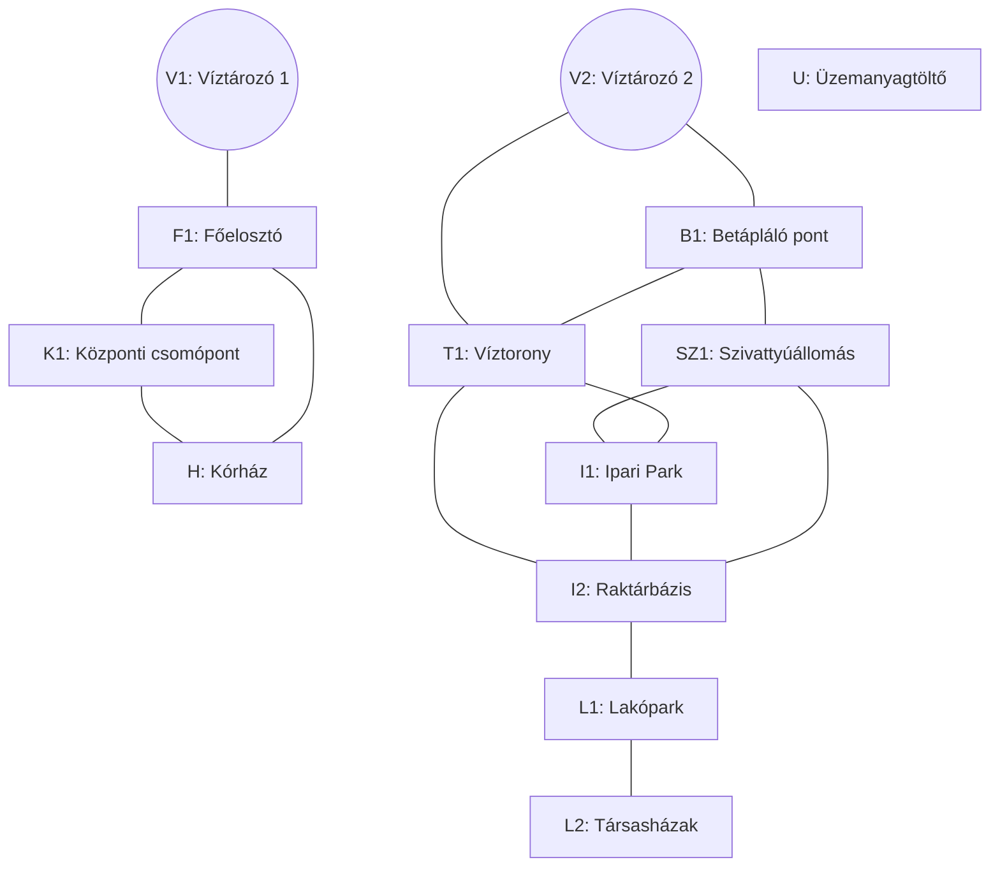

#### A megoldás menete

Összefüggő komponenseket fogunk keresni, V1 és V2 csúcsokból kiindulva, illetve nyilvántartjuk, mely csúcsokat nem láttuk még. Az algoritmus futásának végén, ezen halmaz elemei fogják megmondani, mely csúcsok nem kapnak jelenleg sehonnan vizet.

Meglátogatlan csúcsok:

```
{ V1, V2, U, F1, B1, K1, T1, SZ1, H, I1, I2, L1, L2 }
```

1. Bejárás: V1 víztározó hatóköre

| Iteráció | Aktuális csúcs ($u$) | Open halmaz (Queue) | Closed halmaz (Látogatott) | Esemény / Észrevétel                      |
| :------- | :------------------- | :------------------ | :------------------------- | :---------------------------------------- |
| **0.**   | -                    | `[V1]`              | `{V1}`                     | V1-ből indulunk.                          |
| **1.**   | **V1**               | `[F1]`              | `{V1, F1}`                 | F1 elérése.                               |
| **2.**   | **F1**               | `[K1, H]`           | `{V1, F1, K1, H}`          | K1 és H felfedezése.                      |
| **3.**   | **K1**               | `[H]`               | `{V1, F1, K1, H}`          | H már a sorban van, nem adjuk hozzá újra. |
| **4.**   | **H**                | `[]`                | `{V1, F1, K1, H}`          | Sor üres. **V1 körzete: {V1, F1, K1, H}** |

Meglátogatlan csúcsok:

```
{ V2, U, B1, T1, SZ1, I1, I2, L1, L2 }
```

2. Bejárás: A V2 víztározó ellátási körzete

| Iteráció | Aktuális csúcs ($u$) | Open halmaz (Queue) | Closed halmaz (Látogatott)  | Esemény / Észrevétel                      |
| :------- | :------------------- | :------------------ | :-------------------------- | :---------------------------------------- |
| **0.**   | -                    | `[V2]`              | `{V2}`                      | Új mérés indítása a V2 forrásból.         |
| **1.**   | **V2**               | `[B1, T1]`          | `{V2, B1, T1}`              | B1 és T1 bekerül a sorba.                 |
| **2.**   | **B1**               | `[T1, SZ1]`         | `{V2, B1, T1, SZ1}`         | T1 már sorban van, SZ1 új elem.           |
| **3.**   | **T1**               | `[SZ1, I1, I2]`     | `{V2, B1, T1, SZ1, I1, I2}` | T1-ből I1 és I2 is elérhető.              |
| **4.**   | **SZ1**              | `[I1, I2]`          | `{V2, B1, T1, SZ1, I1, I2}` | I1 és I2 már ismertek, nincs változás.    |
| **5.**   | **I1**               | `[I2]`              | `{V2, B1, T1, SZ1, I1, I2}` | Minden szomszéd (SZ1, T1, I2) látogatott. |
| **6.**   | **I2**               | `[L1]`              | `{V2..I2, L1}`              | Az I2 ponton keresztül elérjük az L1-et.  |
| **7.**   | **L1**               | `[L2]`              | `{V2..L1, L2}`              | L2 (Társasházak) bekerül a sorba.         |
| **8.**   | **L2**               | `[]`                | `{V2..L2}`                  | A sor kiürült. **V2 körzete kész.**       |

Meglátogatlan csúcsok:

```
{ U }
```

- Konklúzió:

  - V1 által ellátott pontok: { V1, F1, K1, H }
  - V2 által ellátott pontok: { V2, B1, T1, SZ1, I1, I2, L1, L2 }
  - Víz nélküli pontok: { U }

#### Kód

```js
/**
 * BFS alapú összefüggőségi vizsgálat vízhálózathoz
 */

// 1. Csúcsok definiálása (indexek és nevek összerendelése)
const nodes = [
  "V1",
  "F1",
  "K1",
  "H",
  "V2",
  "B1",
  "T1",
  "SZ1",
  "I1",
  "I2",
  "L1",
  "L2",
  "U",
];
const nodeToIndex = Object.fromEntries(nodes.map((name, i) => [name, i]));

// 2. Szomszédsági mátrix inicializálása (13x13-as nulla mátrix)
const size = nodes.length;
const matrix = Array.from({ length: size }, () => Array(size).fill(0));

// 3. Élek hozzáadása (mivel irányítatlan, mindkét irányba 1-est teszünk)
function addEdge(u, v) {
  const i = nodeToIndex[u];
  const j = nodeToIndex[v];
  matrix[i][j] = 1;
  matrix[j][i] = 1;
}

// Élek definiálása a gráf alapján
addEdge("V1", "F1");
addEdge("F1", "K1");
addEdge("K1", "H");
addEdge("F1", "H");
addEdge("V2", "B1");
addEdge("V2", "T1");
addEdge("B1", "SZ1");
addEdge("B1", "T1");
addEdge("T1", "I1");
addEdge("SZ1", "I1");
addEdge("T1", "I2");
addEdge("I1", "I2");
addEdge("SZ1", "I2");
addEdge("I2", "L1");
addEdge("L1", "L2");

/**
 * BFS algoritmus egy adott forrásból
 */
function bfs(startNodeName, visitedGlobal) {
  const startIdx = nodeToIndex[startNodeName];
  if (visitedGlobal.has(startIdx)) return null;

  const queue = [startIdx];
  const component = new Set();
  const visitedLocal = new Set();

  visitedLocal.add(startIdx);
  visitedGlobal.add(startIdx);

  while (queue.length > 0) {
    const u = queue.shift();
    component.add(nodes[u]);

    // Szomszédok keresése a mátrix adott sorában
    for (let v = 0; v < size; v++) {
      if (matrix[u][v] === 1 && !visitedLocal.has(v)) {
        visitedLocal.add(v);
        visitedGlobal.add(v);
        queue.push(v);
      }
    }
  }
  return Array.from(component);
}

// 4. Futtatás a forrásokra és hiányelemzés
const visitedGlobal = new Set();

const v1Area = bfs("V1", visitedGlobal);
const v2Area = bfs("V2", visitedGlobal);

// Maradék (ellátatlan) pontok keresése
const notSupplied = nodes.filter((_, i) => !visitedGlobal.has(i));

// Eredmények kiírása
console.log("V1 ellátási körzete:", v1Area);
console.log("V2 ellátási körzete:", v2Area);
console.log("Ellátatlan pontok:", notSupplied);
```

```log
V1 ellátási körzete: [ 'V1', 'F1', 'K1', 'H' ]
V2 ellátási körzete: [
  'V2',  'B1', 'T1',
  'SZ1', 'I1', 'I2',
  'L1',  'L2'
]
Ellátatlan pontok: [ 'U' ]
```

## Totálisan unimoduláris (TU) mátrixok

A hálózati problémák hatékony megoldhatósága a **totálisan unimoduláris (TU)** mátrixok tulajdonságain alapul. Ez teszi lehetővé, hogy egészértékű programozási feladatokat lineáris programozási (LP) módszerekkel oldjunk meg.

### Definíció és alapvető tulajdonságok

Egy $A$ mátrix **totálisan unimoduláris**, ha minden négyzetes részmátrixának determinánsa a $\{0, 1, -1\}$ halmaz eleme.

- **Következmény:** Egy TU mátrix elemei kizárólag $0, 1$ vagy $-1$ értékek lehetnek (mivel az $1 \times 1$-es részmátrixok maguk az elemek).

### A Hoffman–Kruskal tétel

Ha az $Ax \leq b$ feltételrendszerben az $A$ mátrix **TU** és a $b$ vektor **egész számokból** áll, akkor a lehetséges megoldások poliéderének **összes csúcspontja** egész koordinátájú.

**Gyakorlati jelentőség:**
Az egészértékű programozási (IP) feladatok LP-relaxációja (szimplex algoritmus) automatikusan egész számú optimális megoldást ad, mivel az algoritmus a poliéder csúcspontjain halad keresztül. Ezzel elkerülhető a kerekítés és a bonyolultabb IP algoritmusok használata.

### Gráfelméleti vonatkozások

A hálózati modellek azért kezelhetők LP-ként, mert a gráfok illeszkedési mátrixai TU szerkezetűek:

1. **Irányított gráfok illeszkedési mátrixa:** Mindig TU. Minden oszlopban pontosan egy $+1$ (végpont) és egy $-1$ (kezdőpont) szerepel, a többi elem nulla.
2. **Páros gráfok illeszkedési mátrixa:** Szintén TU. Ez biztosítja például a maximális párosítási feladatok hatékony megoldhatóságát.

### A TU tulajdonság felismerése (Elegendő feltétel)

Egy $0, \pm 1$ elemekből álló mátrix biztosan **TU**, ha:

- Minden oszlopában legfeljebb egy $+1$ és legfeljebb egy $-1$ szerepel.

_(Megjegyzés: Ez a feltétel fennáll minden irányított folyamprobléma illeszkedési mátrixára.)_

### Feladat: Gyártási ütemezés és készletelosztás (Négyzetes TU mátrix)

**A szituáció:**
Egy gyártósoron három egymást követő munkaállomás (M1, M2, M3) napi alapanyag-igényét kell kielégíteni. Három különböző típusú ellátási csomag (C1, C2, C3) áll rendelkezésre. Az $A$ mátrix sorai az állomások ellátási kényszereit, oszlopai a csomagok hatókörét reprezentálják:

- A **C1** csomag az M1 munkaállomáshoz szükséges.
- A **C2** csomag az M1 és M2 munkaállomásokhoz egyaránt felhasználható.
- A **C3** csomag az M2 és M3 munkaállomások igényeit is kielégíti.

A feladatot leíró négyzetes együtthathatómátrix ($A$):

$$
A = \begin{pmatrix}
1 & 1 & 0 \\
0 & 1 & 1 \\
0 & 0 & 1
\end{pmatrix}
$$

#### A totálisan unimoduláris tulajdonság igazolása

A definíció alapján egy mátrix totálisan unimoduláris (TU), ha minden négyzetes részmátrixának determinánsa a $\{0, 1, -1\}$ halmaz eleme. Vizsgáljuk meg az $A$ mátrixot:

- **A teljes mátrix determinánsa:**
  Mivel $A$ egy felső háromszögmátrix (minden elem a főátló alatt 0), a determinánsa a főátlón lévő elemek szorzata:
  $$\det(A) = 1 \cdot 1 \cdot 1 = 1$$
- **Alacsonyabb rendű részmátrixok:**
  A mátrix minden eleme $0$ vagy $1$. Bármely $2 \times 2$-es részmátrixot kiválasztva (például a bal felső sarkot: $1 \cdot 1 - 1 \cdot 0 = 1$) a determináns értéke a $\{0, 1, -1\}$ halmazban marad.

Mivel minden négyzetes részmátrix determinánsa megfelel a feltételnek, az **$A$ mátrix totálisan unimoduláris**.

#### Lineáris programozási modell

Írjuk fel a feladatot lineáris programozási (LP) relaxációként, ahol $x_j$ a kirendelt csomagok számát jelöli, és a bináris kényszert feloldva megengedjük a folytonos értékeket:

**Célfüggvény:** $\min (x_1 + x_2 + x_3)$
**Korlátozó feltételek:**

1. $x_1 + x_2 \ge 1$ (M1 állomás ellátása)
2. $x_2 + x_3 \ge 1$ (M2 állomás ellátása)
3. $x_3 \ge 1$ (M3 állomás ellátása)
4. $x_1, x_2, x_3 \ge 0$ (Nemnegativitási korlát)

#### Következtetések

Az $A$ mátrix TU tulajdonsága közvetlen hatással van a megoldás minőségére:

- **Garantált egészértékűség:** A Hoffman–Kruskal tétel kimondja, hogy ha a feltételrendszer mátrixa TU és a korlátok (jobb oldali vektor) egész számok, akkor az LP feladat minden bázismegoldása egész koordinátájú. Ebben a feladatban az optimális megoldás $x_1 = 0, x_2 = 0, x_3 = 1$ lesz, de soha nem kapunk törtszámú eredményt.
- **Számítási hatékonyság:** A gyakorlatban ez azt jelenti, hogy a feladat megoldásához elegendő a polinomiális idejű szimplex algoritmust használni. Nem szükséges speciális egészértékű programozási (IP) eljárások alkalmazása, mert a poliéder csúcspontjai eleve egészek.
- **Strukturális integritás:** A mátrix szerkezete (ahol az egyesek minden oszlopban összefüggő blokkot alkotnak) tipikus példája az **intervallum-mátrixoknak**. Ezek a struktúrák bizonyítottan TU tulajdonságúak, ami biztosítja a folyamatok oszthatatlanságát az optimalizáció során, feloldva az ellentmondást a folytonos modell és a diszkrét egységek (csomagok) között.

## Hálózati problémák

A hálózati (network) modellek olyan folyamatokat írnak le, ahol valamilyen entitás (adat, áru, folyadék, áram) áramlik egy pontokból és összeköttetésekből álló rendszerben.

### Miért használjuk őket?

- **Szemléletes:** A valós világ logisztikai, mérnöki vagy informatikai rendszerei közvetlenül lefordíthatók gráfokra (csúcsok és élek).
- **Gyors:** Speciális szerkezetük miatt olyan algoritmusokkal oldhatók meg, amelyek sokkal hatékonyabbak az általános matematikai eljárásoknál.
- **Precíz:** Egyértelműen meghatározható velük a szűk keresztmetszet, a legolcsóbb útvonal vagy a maximális áteresztőképesség.

### A hálózat alapfogalmai

Minden hálózati feladat az alábbi három összetevőre épül:

1.  **Forrás és Nyelő:** A pontok, ahol az anyag belép a rendszerbe (forrás), és ahol elhagyja azt (nyelő).
2.  **Kapacitás:** Az élek (csatornák) fizikai korlátja; ennél több egység nem haladhat át rajtuk.
3.  **Áram (Flow):** A ténylegesen szállított mennyiség, amely nem haladhatja meg a kapacitást, és a köztes pontokban nem "tűnhet el" (ami befolyik, annak ki is kell folynia).

A gyakorlati elemzések során a cél általában ezen áramlás optimalizálása: vagy a mennyiséget maximalizáljuk (Max-Flow), vagy az ehhez tartozó költségeket minimalizáljuk (Min-Cost Flow).

A transshipment (szállítmányozási) probléma lényege, hogy az áru nem feltétlenül közvetlenül a forrástól jut el a célig, hanem köztes elosztó központokon (raktárakon, kikötőkön) is áthaladhat.

### Feladat: Egy webáruház logisztikai hálózata

**A szituáció:**
Egy elektronikai webáruház két nagy gyártócsarnokból (**források**) szállít laptopokat három különböző város üzleteibe (**nyelők**). A szállítást nem közvetlenül végzik, hanem két regionális logisztikai központon (**belső pontok**) keresztül, ahol a szállítmányokat átrakodják és szétválogatják.

**A hálózat adatai:**

- **Gyártók (Források):**
  - **G1:** 100 darab laptopot gyárt (Kínálat: $-100$)
  - **G2:** 150 darab laptopot gyárt (Kínálat: $-150$)
- **Városi üzletek (Nyelők):**
  - **U1:** 80 darab laptopot igényel (Kereslet: $+80$)
  - **U2:** 70 darab laptopot igényel (Kereslet: $+70$)
  - **U3:** 100 darab laptopot igényel (Kereslet: $+100$)
- **Elosztó központok (Belső pontok):**
  - **K1 és K2:** Itt nem gyártanak és nem adnak el semmit (Értékük: $0$). Ami ide beérkezik, annak tovább is kell mennie.

**A hálózat:**

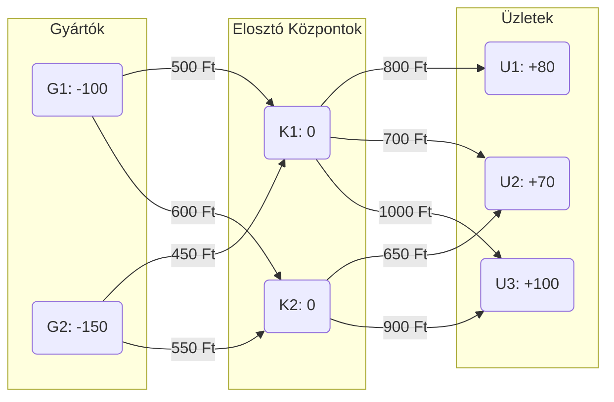

**A cél:**
Határozzuk meg, hogy melyik útvonalon hány darab laptopot szállítsunk ahhoz, hogy minden üzlet igénye teljesüljön, de a teljes hálózat szállítási költsége a lehető legalacsonyabb legyen.

#### Megoldás

A feladat lineáris programozással megoldható:

**Célfüggvény:**
$$\min Z = 500x_{G1,K1} + 600x_{G1,K2} + 450x_{G2,K1} + 550x_{G2,K2} + 800x_{K1,U1} + 700x_{K1,U2} + 1000x_{K1,U3} + 650x_{K2,U2} + 900x_{K2,U3}$$

**Korlátozó feltételek:**

- **Források (Kínálat):**
  - $x_{G1,K1} + x_{G1,K2} = 100$
  - $x_{G2,K1} + x_{G2,K2} = 150$
- **Átrakodó állomások (Mérlegegyenlet):**
  - $x_{G1,K1} + x_{G2,K1} - (x_{K1,U1} + x_{K1,U2} + x_{K1,U3}) = 0$
  - $x_{G1,K2} + x_{G2,K2} - (x_{K2,U2} + x_{K2,U3}) = 0$
- **Nyelők (Kereslet):**
  - $x_{K1,U1} = 80$
  - $x_{K1,U2} + x_{K2,U2} = 70$
  - $x_{K1,U3} + x_{K2,U3} = 100$
- **Nemnegativitás:**
  - $x_{i,j} \ge 0 \quad \forall (i,j) \in E$

### Feladat: Logisztikai konténerek optimalizálása

Egy tengeri szállítmányozó cégnek egy **6 hetes** projekt során speciális hűtőkonténerekre van szüksége. A heti igények a következők:

- **1. hét:** 40 db
- **2. hét:** 60 db
- **3. hét:** 90 db
- **4. hét:** 80 db
- **5. hét:** 100 db
- **6. hét:** 70 db

A szükségletet három forrásból fedezhetik:

1.  **Új konténer bérlése:** **1500 EUR** / db (azonnal elérhető).
2.  **Gyors szerviz:** **1 hét** átfutási idő (az $i$. hét végén leadott konténer az $i+2$. hét elején kész), költsége **600 EUR** / db.
3.  **Lassú szerviz:** **2 hét** átfutási idő (az $i$. hét végén leadott konténer az $i+3$. hét elején kész), költsége **250 EUR** / db.

A használt konténerek tárolása a telephelyen ingyenes. A cél a projekt teljes költségének minimalizálása.

#### Megoldás és költségszámítás

| Hét    | Igény ($d_i$) | Megoldás forrása                            | Számítás (db × EUR)                  | Költség |
| :----- | :------------ | :------------------------------------------ | :----------------------------------- | :------ |
| **1.** | 40            | 40 új bérlés                                | $40 \times 1500$                     | 60 000  |
| **2.** | 60            | 60 új bérlés                                | $60 \times 1500$                     | 90 000  |
| **3.** | 90            | 40 gyors (1. hétről) + 50 új                | $(40 \times 600) + (50 \times 1500)$ | 99 000  |
| **4.** | 80            | 60 lassú (2. hétről) + 20 új                | $(60 \times 250) + (20 \times 1500)$ | 45 000  |
| **5.** | 100           | 90 lassú (3. hétről) + 10 gyors (4. hétről) | $(90 \times 250) + (10 \times 600)$  | 28 500  |
| **6.** | 70            | 70 lassú (4. hétről maradt 70)              | $70 \times 250$                      | 17 500  |

**Összesített adatok:**

- **Összes bérelt új konténer:** 170 db
- **Összes gyors szerviz:** 50 db
- **Összes lassú szerviz:** 220 db
- **Minimális összköltség:** **340 000 EUR**

#### Hálózati modell (Min-Cost Flow)

A feladat egy irányított gráffal reprezentálható, ahol:

- **Csúcsok:** Minden héthez két csúcs tartozik: $u_i$ (a hét végén keletkező használt konténerek) és $v_i$ (a hét eleji konténerigény).
- **Kínálat/Kereslet:** Minden $u_i$ csúcs kínálata $d_i$, minden $v_i$ csúcs kereslete $d_i$.
- **Élek:**
  - **Vásárlás:** Forrás $\rightarrow v_i$ él, költség: $1500$.
  - **Gyors szerviz:** $u_i \rightarrow v_{i+2}$ él, költség: $600$.
  - **Lassú szerviz:** $u_i \rightarrow v_{i+3}$ él, költség: $250$.
  - **Várakozás:** $u_i \rightarrow u_{i+1}$ él, költség: $0$.

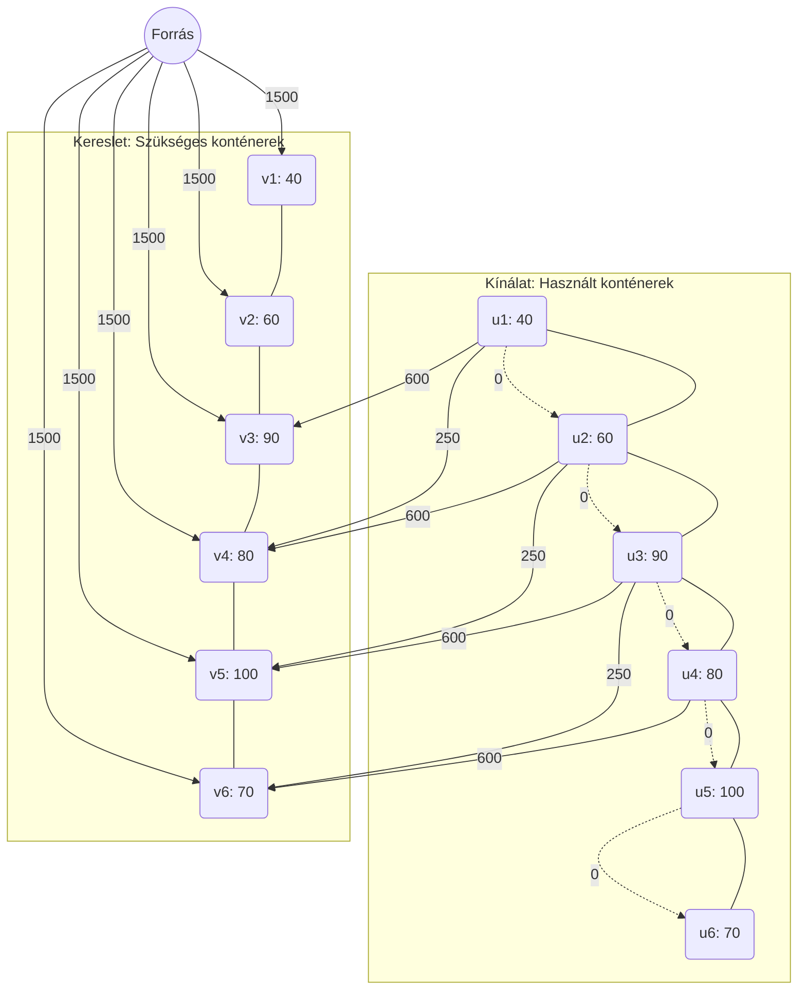

## Intervallum gráfok

Az intervallum gráfok a geometriai gráfok egy speciális osztályát alkotják, amelyek jól modellezik az időbeli átfedéseket vagy erőforrás-ütközéseket.

### Definíció

Egy $G = (V, E)$ gráf **intervallum gráf**, ha csúcsaihoz hozzárendelhető a valós számegyenes egy-egy $I_i = [t_i, T_i]$ intervalluma úgy, hogy két csúcs között pontosan akkor van él, ha a hozzájuk tartozó intervallumok metszete nem üres:
$$u v \in E \iff I_u \cap I_v \neq \emptyset$$

### Főbb tulajdonságok

- **Perfekt gráfok:** Az intervallum gráfokra igaz, hogy a klikkszámuk ($\omega(G)$) megegyezik a kromatikus számukkal ($\chi(G)$).
- **Húrgráfok:** Nem tartalmaznak 3-nál hosszabb indukált kört (azaz minden 4 vagy több hosszú körnek van "húrja").
- **Mohó algoritmus:** Sok NP-nehéz probléma (színezés, maximális független csúcshalmaz) intervallum gráfokon lineáris időben, mohó módon megoldható.

### Feladat: Az Influencer Kampány Optimalizálása (Lefedő halmaz)

Egy marketingügynökség egy új terméket akar népszerűsíteni. 6 különböző influencer vállalta, hogy készít egy-egy "élő bejelentkezést" (live stream) a saját csatornáján a hétvége folyamán. A cégnek delegálnia kell egy moderátort, aki jelen van a streamek alatt, hogy válaszoljon a kérdésekre. A moderátor óradíja magas, ezért a cél az, hogy **a lehető legkevesebb időpontban** csatlakozzon be a moderátor úgy, hogy minden influencer adásába legalább egyszer "belépjen".

#### Az adatok (időintervallumok szombat 10:00-tól számítva, órában)

- **Influencer 1:** [0, 3] (10:00 – 13:00)
- **Influencer 2:** [1, 4] (11:00 – 14:00)
- **Influencer 3:** [2, 5] (12:00 – 15:00)
- **Influencer 4:** [6, 8] (16:00 – 18:00)
- **Influencer 5:** [7, 10] (17:00 – 20:00)
- **Influencer 6:** [4, 7] (14:00 – 17:00)

#### A feladat

Határozd meg a moderátor belépési időpontjainak minimális számát és a konkrét időpontokat!

#### Gráf

Ez a gráf reprezentálja az influenszerek adásait. Csúcsok a különböző adások, élek olyan csúcspárok közt találhatóak, amely adások közt van átfedés.

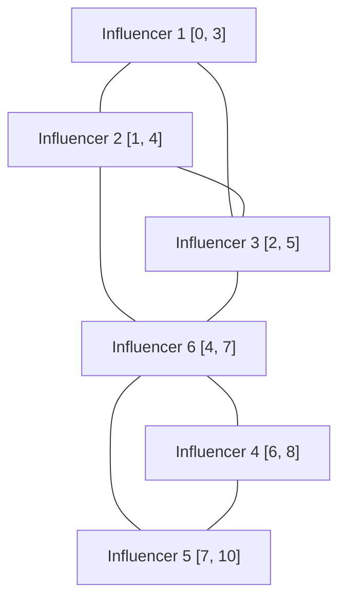

#### Megoldás (A jegyzetben szereplő mohó algoritmussal)

**1. Lépés: Rendezés a jobb végpontok szerint**
Rendezzük az élő adásokat aszerint, hogy melyik fejeződik be legkorábban:

1.  Influencer 1: [0, **3**]
2.  Influencer 2: [1, **4**]
3.  Influencer 3: [2, **5**]
4.  Influencer 6: [4, **7**]
5.  Influencer 4: [6, **8**]
6.  Influencer 5: [7, **10**]

**2. Lépés: Az első ellenőrző pont kiválasztása**
Vegyük a legelső befejezési időpontot: **$T_1 = 3$**.
A moderátor belép a 3. órában (13:00-kor).

- **Kit fed le?** Aki ekkor épp online van: **Influencer 1, 2 és 3**. Ezeket a sorból kihúzzuk.

**3. Lépés: A következő pont kiválasztása a maradékból**
A megmaradt adások (6, 4, 5) közül a legkorábbi befejezés az Influencer 6-é: **$T_6 = 7$**.
A moderátor belép a 7. órában (17:00-kor).

- **Kit fed le?** Aki ekkor épp online van: **Influencer 6, 4 és 5**. (Mivel a 4-es és 5-ös adása is átfedi a 7. órát).

#### Konklúzió

A minimális lefedő halmaz mérete **$k = 2$**.
Az optimális megoldás: A moderátornak elég **13:00-kor** és **17:00-kor** bejelentkeznie. Ezzel a két rövid időponttal az összes (mind a 6) influencer kampányában részt vett.

> **Miért optimális?** Mert az Influencer 1 [0,3] és az Influencer 6 [4,7] intervallumok teljesen diszjunktak (nincs átfedésük). Ezért matematikailag lehetetlen 2-nél kevesebb ponttal lefedni a rendszert, hiszen ehhez a két adáshoz mindenképp két külön időpont kell.

#### Kód

```js
/**
 * Intervallum lefedő probléma megoldása (Mohó algoritmus)
 * @param {Array} intervals - Az intervallumok listája [kezdet, vég] formátumban
 * @returns {Array} - A kiválasztott optimális időpontok (pontok) listája
 */
function solveIntervalCovering(intervals) {
  if (intervals.length === 0) return [];

  // 1. Lépés: Rendezés a jobb végpontok (Ti) szerint növekvő sorrendbe
  // Fontos: a mohó választás alapja a legkorábbi befejezés!
  const sortedIntervals = [...intervals].sort((a, b) => a[1] - b[1]);

  const coveringPoints = [];

  // Az első pontot a legelsőként végződő intervallum végpontjába tesszük
  let lastPoint = sortedIntervals[0][1];
  coveringPoints.push(lastPoint);

  // 2. Lépés: Iterálás a többi intervallumon
  for (let i = 1; i < sortedIntervals.length; i++) {
    const [start, end] = sortedIntervals[i];

    // Ha a jelenlegi intervallum már tartalmazza az utolsó lehelyezett pontot,
    // akkor ez az intervallum már le van fedve, ugorhatunk.
    if (start <= lastPoint && lastPoint <= end) {
      continue;
    }

    // Ha nincs lefedve, lehelyezünk egy új pontot a jelenlegi intervallum végpontjába
    lastPoint = end;
    coveringPoints.push(lastPoint);
  }

  return coveringPoints;
}

// --- Tesztelés az Influencer példával ---
const influencerSlots = [
  [0, 3], // Influencer 1
  [1, 4], // Influencer 2
  [2, 5], // Influencer 3
  [6, 8], // Influencer 4
  [7, 10], // Influencer 5
  [4, 7], // Influencer 6
];

const result = solveIntervalCovering(influencerSlots);

console.log("Optimális időpontok a moderátor belépéséhez:", result);
```

```log
Optimális időpontok a moderátor belépéséhez: [ 3, 7 ]
```

### Feladat: Konferencia-terem foglalás (Színezés)

Egy technológiai konferencián 6 különböző workshopot kell megtartani egy délután alatt. Mindegyik workshopnak fix kezdési és befejezési időpontja van. Mivel a workshopok zavarják egymást, két olyan esemény, amely időben átfedi egymást, nem kerülhet ugyanabba a terembe.

**A cél:** Határozd meg a **minimális számú termet**, amelyre szükség van az összes workshop lebonyolításához.

#### Az adatok (Időintervallumok órában kifejezve)

1.  **A workshop (AI alapok):** [10, 12]
2.  **B workshop (Web design):** [11, 13]
3.  **C workshop (Cybersecurity):** [10.5, 11.5]
4.  **D workshop (Cloud computing):** [13.5, 15]
5.  **E workshop (Data science):** [13, 14.5]
6.  **F workshop (Blockchain):** [14.5, 16]

#### Gráf

A gráfban minden csúcs egy workshopot jelöl, és két csúcs között akkor van él, ha a workshopok időben átfedik egymást (ütköznek).

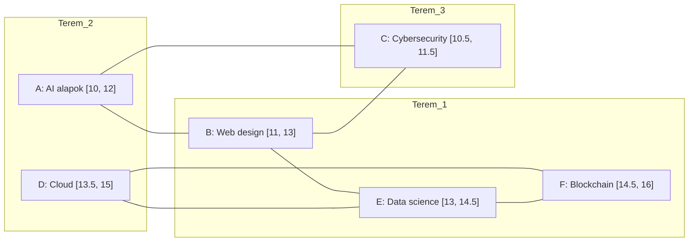

#### Megoldás az intervallum színezési algoritmussal

Az optimális színezés (teremkiosztás) érdekében az eseményeket a befejezési időpontjuk (jobb végpont) szerint csökkenő sorrendbe rendezzük, és mohó módon kiosztjuk a legkisebb szabad sorszámú termet.

**1. Lépés: Rendezés a befejezés szerint (csökkenő)**

1.  F: [14.5, **16**]
2.  D: [13.5, **15**]
3.  E: [13, **14.5**]
4.  B: [11, **13**]
5.  A: [10, **12**]
6.  C: [10.5, **11.5**]

**2. Lépés: Termek kiosztása (Színezés)**

- **F [14.5, 16]:** Megkapja az **1. termet**.
- **D [13.5, 15]:** Átfedi F-et az [14.5, 15] tartományban. Az 1. terem foglalt, így megkapja a **2. termet**.
- **E [13, 14.5]:** F-fel csak a végponton érintkezik (14.5), de D-vel átfedésben van [13.5, 14.5]. Mivel F már nem használja az 1. termet ebben az időben, az E megkaphatja az **1. termet**.
- **B [11, 13]:** Sem F-fel, sem D-vel, sem E-vel nem fed át. Az **1. terem** szabad számára.
- **A [10, 12]:** Átfedi B-t [11, 12]. Az 1. terem foglalt, így megkapja a **2. termet**.
- **C [10.5, 11.5]:** Átfedi A-t és B-t is. Az 1. és 2. terem foglalt, így megkapja a **3. termet**.

#### Konklúzió

A minimális teremigény: **3**.

#### Kód

```js
/**
 * Intervallum gráf színezése (Teremfoglalás optimalizálás)
 * @param {Array} events - Az események listája: { name: string, start: number, end: number }
 * @returns {Object} - A termek száma és a hozzájuk rendelt események
 */
function solveRoomAssignment(events) {
  if (events.length === 0) return { roomCount: 0, assignments: {} };

  // 1. Lépés: Rendezés a JOBB végpontok (befejezési idő) szerint CSÖKKENŐ sorrendbe
  // (A megadott elméleti stratégia alapján)
  const sortedEvents = [...events].sort((a, b) => b.end - a.end);

  const rooms = []; // Itt tároljuk az egyes termekbe osztott eseményeket

  // 2. Lépés: Iterálás az eseményeken
  for (let event of sortedEvents) {
    let assigned = false;

    // Megpróbáljuk betenni az eseményt egy már meglévő terembe
    for (let i = 0; i < rooms.length; i++) {
      // Ellenőrizzük, van-e ütközés a teremben lévő eseményekkel
      const hasConflict = rooms[i].some(
        (e) => event.start < e.end && event.end > e.start
      );

      if (!hasConflict) {
        rooms[i].push(event);
        assigned = true;
        break;
      }
    }

    // Ha egyik létező terembe sem fér be, nyitunk egy újat
    if (!assigned) {
      rooms.push([event]);
    }
  }

  return {
    roomCount: rooms.length,
    schedule: rooms.map((room, index) => ({
      roomNumber: index + 1,
      events: room.map((e) => `${e.name} (${e.start}-${e.end})`),
    })),
  };
}

// --- Adatok bevitele ---
const workshops = [
  { name: "A: AI alapok", start: 10, end: 12 },
  { name: "B: Web design", start: 11, end: 13 },
  { name: "C: Cybersecurity", start: 10.5, end: 11.5 },
  { name: "D: Cloud computing", start: 13.5, end: 15 },
  { name: "E: Data science", start: 13, end: 14.5 },
  { name: "F: Blockchain", start: 14.5, end: 16 },
];

const result = solveRoomAssignment(workshops);

// --- Eredmény kiíratása ---
console.log(`Minimálisan szükséges termek száma: ${result.roomCount}`);
console.log("Beosztás:");
result.schedule.forEach((r) => {
  console.log(`  ${r.roomNumber}. Terem: ${r.events.join(", ")}`);
});
```

```log
Minimálisan szükséges termek száma: 3
Beosztás:
  1. Terem: F: Blockchain (14.5-16), E: Data science (13-14.5), B: Web design (11-13)
  2. Terem: D: Cloud computing (13.5-15), A: AI alapok (10-12)
  3. Terem: C: Cybersecurity (10.5-11.5)
```

### Feladat: Szabadúszó projekt-ütemezése (Maximális független halmaz)

Egy szabadúszó videóvágóhoz egy napon 7 különböző megbízás érkezik. Mindegyik munka teljes odafigyelést igényel (nem tud egyszerre két projekten dolgozni), és fix időablakban kell elvégezni őket (például élő közvetítések vágása). A vágó fix díjas megbízásokat kap, ezért az a célja, hogy **a lehető legtöbb munkát** vállalja el a nap folyamán.

#### Az adatok (Időintervallumok órában)

1.  **P1 (Reklámfilm):** [8, 11]
2.  **P2 (Interjú):** [9, 10.5]
3.  **P3 (Zenei klip):** [10, 12]
4.  **P4 (Esküvő):** [11.5, 14]
5.  **P5 (Social media videó):** [13, 15]
6.  **P6 (Termékbemutató):** [14.5, 17]
7.  **P7 (YouTube vlog):** [16, 18]

#### Megoldás a mohó algoritmussal

Az intervallum gráfoknál a maximális független halmazt úgy kapjuk meg a leggyorsabban, ha a **befejezési időpontok (jobb végpontok) szerint növekvő** sorrendbe rendezünk, és mindig a legkorábban végződőt választjuk, ami nem ütközik az eddigiekkel.

**1. Lépés: Rendezés a befejezés szerint (növekvő)**

1.  P2: [9, **10.5**]
2.  P1: [8, **11**]
3.  P3: [10, **12**]
4.  P4: [11.5, **14**]
5.  P5: [13, **15**]
6.  P6: [14.5, **17**]
7.  P7: [16, **18**]

**2. Lépés: Kiválasztás (Mohó módon)**

- **Választjuk P2-t [9, 10.5]:** Ez végződik legkorábban. (A vágó 10:30-kor végez).
- **Következő jelölt P1 [8, 11]:** Ütközik P2-vel (már 8-kor kezdődne). **Kihagyjuk.**
- **Következő jelölt P3 [10, 12]:** Ütközik P2-vel (10-kor kezdődik). **Kihagyjuk.**
- **Választjuk P4 [11.5, 14]:** Nem ütközik az utolsó választottal (P2 10:30-as végével). (A vágó 14:00-kor végez).
- **Következő jelölt P5 [13, 15]:** Ütközik P4-gyel (13-kor kezdődik). **Kihagyjuk.**
- **Választjuk P6 [14.5, 17]:** Nem ütközik P4-gyel (14:30-kor kezdődik). (A vágó 17:00-kor végez).
- **Következő jelölt P7 [16, 18]:** Ütközik P6-tal (16-kor kezdődik). **Kihagyjuk.**

#### Konklúzió

A maximális független halmaz mérete **3**. A vágó maximum 3 projektet tud elvégezni: **P2, P4 és P6**.

#### Gráf

Ebben a gráfban a **maximális független halmaz** olyan csúcsok csoportja, amelyek között **egyáltalán nincs él**.

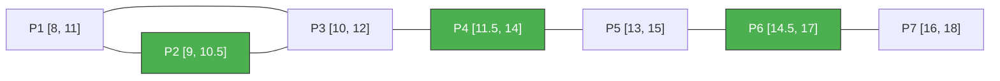

#### Kód

```javascript
/**
 * Maximális független halmaz keresése (Ütemezés optimalizálás)
 * @param {Array} jobs - { name: string, start: number, end: number }
 * @returns {Array} - A kiválasztott, egymással nem ütköző munkák listája
 */
function solveMaxIndependentSet(jobs) {
  if (jobs.length === 0) return [];

  // 1. Lépés: Rendezés a JOBB végpontok szerint NÖVEKVŐ sorrendbe
  const sortedJobs = [...jobs].sort((a, b) => a.end - b.end);

  const selectedJobs = [];
  let lastFinishTime = -Infinity;

  // 2. Lépés: Mohó kiválasztás
  for (let job of sortedJobs) {
    // Ha a munka kezdete nem korábbi, mint az utolsó befejezése (nincs átfedés)
    if (job.start >= lastFinishTime) {
      selectedJobs.push(job);
      lastFinishTime = job.end;
    }
  }

  return selectedJobs;
}

const munkak = [
  { name: "P1: Reklám", start: 8, end: 11 },
  { name: "P2: Interjú", start: 9, end: 10.5 },
  { name: "P3: Zenei klip", start: 10, end: 12 },
  { name: "P4: Esküvő", start: 11.5, end: 14 },
  { name: "P5: Social media", start: 13, end: 15 },
  { name: "P6: Termékbemutató", start: 14.5, end: 17 },
  { name: "P7: Vlog", start: 16, end: 18 },
];

const megoldas = solveMaxIndependentSet(munkak);

console.log("Maximálisan elvégezhető munkák száma:", megoldas.length);
console.log("Kiválasztott projektek:", megoldas.map((m) => m.name).join(", "));
```

```log
Maximálisan elvégezhető munkák száma: 3
Kiválasztott projektek: P2: Interjú, P4: Esküvő, P6: Termékbemutató
```

## Háromszögezett gráfok

## Háromszögezett gráfok (Húrgráfok)

A háromszögezett gráfok (más néven húrozott vagy merevkörű gráfok) a gráfelmélet egy kiemelt jelentőségű osztályát alkotják, mivel szerkezetük lehetővé teszi számos, egyébként nehéz (NP-hard) probléma hatékony megoldását.

### Definíció

Egy $G$ gráf **háromszögezett**, ha nem tartalmaz feszített $C_n$ kört $n \geq 4$ esetén. Ez azt jelenti, hogy a gráf minden legalább 4 hosszúságú körének van legalább egy **húrja** (olyan él, amely a kör két nem szomszédos pontját köti össze).

---

### Szerkezeti tulajdonságok és fogalmak

A háromszögezett gráfok mélyebb elemzéséhez az alábbi fogalmak elengedhetetlenek:

- **Minimális szeparátor:** Legyen $x$ és $y$ két nem szomszédos pont. Az $S \subset V(G)$ halmaz **$x,y$-szeparátor**, ha $x$ és $y$ különböző komponensbe kerül a $G \setminus S$ gráfban. $S$ akkor **minimális**, ha egyetlen valódi részhalmaza sem választja el $x$-et és $y$-t.

  > **Tétel:** Egy gráf pontosan akkor háromszögezett, ha minden minimális szeparátora klikk (teljes részgráf).

- **Szimpliciális pont:** Egy $x \in V(G)$ pont **szimpliciális**, ha szomszédainak halmaza, azaz $N(x)$ klikket feszít a gráfban.
  > **Dirac-tétel:** Minden nem üres háromszögezett gráfban van legalább két szimpliciális pont (kivéve a teljes gráfokat, ahol minden pont az).

### Perfekt Eliminációs Séma (PES)

A háromszögezett gráfok egyik legfontosabb jellemzője a pontok egy speciális sorrendbe állíthatósága.

Az $x_1, x_2, \dots, x_n$ pontsorozat a $G$ gráf egy **perfekt eliminációs sémája (PES)**, ha minden $i \in \{1, \dots, n\}$ esetén az $x_i$ pont szimpliciális az $\{x_i, x_{i+1}, \dots, x_n\}$ pontok által feszített részgráfban.

**Jelentősége:**

- Egy gráf pontosan akkor háromszögezett, ha létezik hozzá PES.
- A PES segítségével mohó módon, lineáris időben meghatározható a gráf:
  1.  Kromatikus száma ($\chi(G)$)
  2.  Maximális klikkmérete ($\omega(G)$)
  3.  Maximális független csúcshalmaza ($\alpha(G)$)

### Kapcsolat más osztályokkal

A háromszögezett gráfok a **perfekt gráfok** egy alosztályát alkotják. Minden intervallum gráf háromszögezett, de ez fordítva nem feltétlenül igaz (az intervallum gráfok a háromszögezett gráfok egy szűkebb halmazát jelentik).

### Feladat: Adatbázis-konzisztencia és Húrgráfok

Egy kórházi szakértői rendszer adatbázisában összefüggéseket tárolunk tünetek és diagnózisok között. A lekérdezések gyorsasága és a logikai ellentmondások elkerülése érdekében fontos, hogy az összefüggések gráfja **háromszögezett (húrgráf)** legyen. Ha a gráfban feszített $C_n (n \geq 4)$ kör található, a lekérdezés-optimalizáló algoritmusok hatékonysága jelentősen romlik.

#### A probléma

A jelenlegi rendszer a következő kapcsolatokat tartalmazza:

- **Láz (L) — Köhögés (K)**
- **Köhögés (K) — Tüdőgyulladás (T)**
- **Tüdőgyulladás (T) — Nehézlégzés (N)**
- **Nehézlégzés (N) — Láz (L)**

Ez a struktúra egy **$C_4$ kört** alkot ($L-K-T-N-L$), amely nem tartalmaz húrt, tehát a gráf nem háromszögezett.

#### Gráf

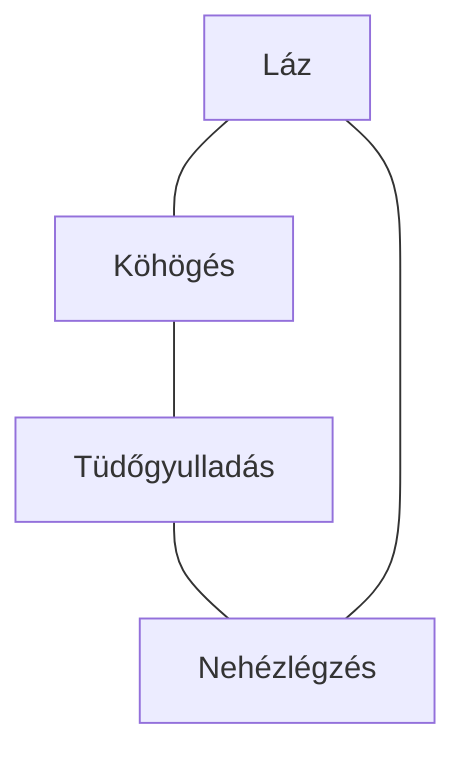

#### Megoldás

Ahhoz, hogy a gráfot háromszögezetté tegyük, be kell vezetnünk egy **húrt**.

1.  **Beavatkozás:** Kössük össze a **Láz (L)** és a **Tüdőgyulladás (T)** pontokat egy új éllel.
2.  **Eredmény:** A feszített $C_4$ kör megszűnik, helyette két darab $C_3$ (háromszög) keletkezik: $\{L, K, T\}$ és $\{L, N, T\}$.

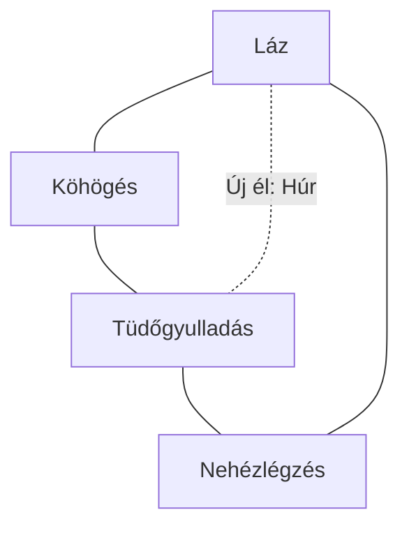

#### Ellenőrzés: Perfekt Eliminációs Séma (PES)

A javított gráfra felírható egy sorrend, ahol minden pont szimpliciális (szomszédai klikket alkotnak) az eltávolítás pillanatában:

- **1. K:** Szomszédai ($L, T$) az új él miatt klikket alkotnak.
- **2. N:** Szomszédai ($L, T$) szintén klikket alkotnak.
- **3. L és T:** A megmaradt él triviálisan szimpliciális pontokat ad.

**Konklúzió:** Az $L-T$ él behúzásával a rendszer szerkezete merevvé vált, így a diagnosztikai lekérdezések futási ideje lineárisra csökkent.

#### Kód a problémához

```js
/**
 * Háromszögezett gráf ellenőrző és javító algoritmus
 */
class ChordalGraphSolver {
  constructor(vertices, edges) {
    this.adj = new Map();
    vertices.forEach((v) => this.adj.set(v, new Set()));
    edges.forEach(([u, v]) => {
      this.adj.get(u).add(v);
      this.adj.get(v).add(u);
    });
  }

  // Ellenőrzi, hogy egy adott pont szimpliciális-e
  isSimplicial(v, currentAdj) {
    const neighbors = Array.from(currentAdj.get(v));
    for (let i = 0; i < neighbors.length; i++) {
      for (let j = i + 1; j < neighbors.length; j++) {
        if (!currentAdj.get(neighbors[i]).has(neighbors[j])) {
          return {
            simplicial: false,
            missingEdge: [neighbors[i], neighbors[j]],
          };
        }
      }
    }
    return { simplicial: true };
  }

  // Megkeresi a Perfekt Eliminációs Sémát (PES) vagy a hibát
  analyze() {
    let tempAdj = new Map();
    this.adj.forEach((neighbors, v) => tempAdj.set(v, new Set(neighbors)));

    const nodes = Array.from(tempAdj.keys());
    const pes = [];
    const missingEdges = [];

    while (nodes.length > 0) {
      let found = false;
      for (let i = 0; i < nodes.length; i++) {
        const node = nodes[i];
        const check = this.isSimplicial(node, tempAdj);

        if (check.simplicial) {
          pes.push(node);
          // Eltávolítjuk a pontot és a hozzá tartozó éleket
          const neighbors = tempAdj.get(node);
          neighbors.forEach((n) => tempAdj.get(n).delete(node));
          tempAdj.delete(node);
          nodes.splice(i, 1);
          found = true;
          break;
        } else {
          missingEdges.push(check.missingEdge);
        }
      }

      if (!found) {
        return {
          isChordal: false,
          suggestedChord: missingEdges[0],
          message: "A gráf nem háromszögezett. Feszített kört találtam.",
        };
      }
    }

    return {
      isChordal: true,
      pes: pes,
      message: "A gráf háromszögezett (Húrgráf).",
    };
  }
}

// --- Tesztelés a diagnosztikai feladattal ---

const vertices = ["L", "K", "T", "N"];
const edges = [
  ["L", "K"],
  ["K", "T"],
  ["T", "N"],
  ["N", "L"],
];

const solver = new ChordalGraphSolver(vertices, edges);
const result = solver.analyze();

console.log("Eredmény:", result.message);
if (!result.isChordal) {
  console.log(
    `Javasolt húr a háromszögezéshez: ${result.suggestedChord.join(" - ")}`
  );
} else {
  console.log("Perfekt Eliminációs Séma (PES):", result.pes.join(" -> "));
}

// Kimenet várhatóan:
// Eredmény: A gráf nem háromszögezett. Feszített kört találtam.
// Javasolt húr a háromszögezéshez: L - T (vagy K - N)
```

```log
Eredmény: A gráf nem háromszögezett. Feszített kört találtam.
Javasolt húr a háromszögezéshez: K - N
```

## Perfekt gráfok

A perfekt gráfok a gráfelmélet egyik legfontosabb osztályát alkotják. Jelentőségüket az adja, hogy bennük a gráf globális tulajdonságai (színezhetőség) és lokális tulajdonságai (maximális klikkméret) szoros összhangban vannak.

### Definíció

Egy $G$ gráf **perfekt**, ha minden feszített $H \subseteq G$ részgráfjára teljesül az alábbi egyenlőség:
$$\chi(H) = \omega(H)$$
ahol:

- $\chi(H)$ a gráf **kromatikus száma** (a minimális színszám, amivel a csúcsok kiszínezhetők úgy, hogy szomszédosak ne legyenek azonos színűek).
- $\omega(H)$ a gráf **klikkszáma** (a legnagyobb teljes részgráf csúcsainak száma).

### A Perfekt Gráf Tételek

Claude Berge 1961-es felvetései után két alapvető tétel határozza meg ezt a területet:

1.  **Gyenge perfekt gráf tétel (Lovász László, 1972):**
    Egy gráf pontosan akkor perfekt, ha a komplementere ($\overline{G}$) is perfekt. Ez azt jelenti, hogy perfekt gráfokban a maximális független csúcshalmaz mérete ($\alpha(G)$) is megegyezik a minimális klikk-lefedés számával.

2.  **Erős perfekt gráf tétel (Chudnovsky, Robertson, Seymour és Thomas, 2002):**
    Egy gráf pontosan akkor perfekt, ha sem ő, sem a komplementere nem tartalmaz **feszített páratlan kört**, amelynek hossza legalább 5.
    - Ezeket a tiltott részgráfokat (páratlan körök és komplementereik) **Berge-gráfoknak** is nevezik.

### Fontosabb perfekt gráfosztályok

Számos jól ismert gráfosztályról bebizonyosodott, hogy perfekt:

- **Páros gráfok:** Itt $\omega(G) \leq 2$, és a színezéshez is maximum 2 szín kell.
- **Intervallum gráfok:** Az időbeli átfedések modelljei mind perfektek.
- **Háromszögezett (húr) gráfok:** Minden legalább 4 hosszú körüknek van húrja.
- **Páros gráfok vonalgráfjai:** Az élszínezési problémáknál relevánsak.

### Algoritmusok és jelentőség

Míg az általános gráfoknál a klikkszám ($\omega$) és a kromatikus szám ($\chi$) meghatározása is **NP-nehéz** probléma, a perfekt gráfok esetében:

- Létezik **polinomidőben** futó algoritmus a kiszámításukra (bár ezek gyakran komplexek, például szemidefinit programozást igényelnek).
- Sok speciális osztályukra (pl. intervallum gráfok) rendkívül gyors, lineáris idejű **mohó algoritmusok** is rendelkezésre állnak.

A perfekt gráfok elmélete hidat képez a kombinatorikus optimalizálás, a gráfalgoritmusok és a matematikai programozás között.

### Összegzés: Mikor NEM perfekt egy gráf?

Egy gráf biztosan nem perfekt, ha tartalmaz:

- Egy feszített $C_5, C_7, \dots$ kört (páratlan lyuk).
- Egy feszített páratlan kör komplementerét (páratlan anti-lyuk).

**Példa:** Az 5 hosszú kör ($C_5$) nem perfekt, mert $\omega(C_5) = 2$ (csak élek vannak benne, háromszögek nincsenek), de a színezéséhez $\chi(C_5) = 3$ színre van szükség.

### Feladat: Frekvenciakiosztás okosotthonban

Egy folyosó mentén elhelyezett szenzorok interferencia-hálózatát kell frekvenciacsatornákkal ellátni. Az ütközéseket egy **intervallum gráf** modellezi, amelyről tudjuk, hogy a **perfekt gráfok** osztályába tartozik.

#### Adatok

- **Modell:** A csúcsok a szenzorok, az élek az interferenciát jelölik.
- **Klikkszám ($\omega$):** A mérések alapján a legnagyobb olyan csoport, ahol minden eszköz zavarja az összes többit, **4** tagú.

#### Kérdés

Mennyi a minimálisan szükséges frekvenciacsatornák száma ($\chi$)?

#### Gráf

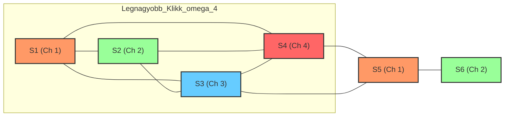

#### Megoldás

Mivel a gráf perfekt, minden feszített részgráfjára — így a teljes gráfra is — igaz, hogy:
$$\chi(G) = \omega(G)$$
Mivel a maximális klikkméret $\omega(G) = 4$, a rendszer zavarmentes működéséhez pontosan **4 különböző frekvenciacsatorna** szükséges.

#### Kód

```js
/**
 * Frekvenciakiosztás szimulálása perfekt gráfon (Mohó színezés)
 */
function assignFrequencies(devices, interferenceEdges) {
  const adj = new Map();
  devices.forEach((d) => adj.set(d, []));

  // Gráf felépítése (szomszédsági lista)
  interferenceEdges.forEach(([u, v]) => {
    adj.get(u).push(v);
    adj.get(v).push(u);
  });

  const assignments = {}; // { eszköz: csatorna_száma }

  // Mohó színezés
  devices.forEach((device) => {
    const neighborChannels = new Set();

    // Megnézzük a szomszédok (ütköző eszközök) csatornáit
    adj.get(device).forEach((neighbor) => {
      if (assignments[neighbor] !== undefined) {
        neighborChannels.add(assignments[neighbor]);
      }
    });

    // Megkeressük a legkisebb szabad csatornát (1-től indulva)
    let channel = 1;
    while (neighborChannels.has(channel)) {
      channel++;
    }

    assignments[device] = channel;
  });

  // Kromatikus szám meghatározása
  const chromaticNumber = Math.max(...Object.values(assignments));

  return {
    assignments,
    chromaticNumber,
  };
}

// --- Adatok (Szenzorok és interferenciák) ---
const sensors = ["S1", "S2", "S3", "S4", "S5", "S6"];
const interference = [
  ["S1", "S2"],
  ["S1", "S3"],
  ["S1", "S4"],
  ["S2", "S3"],
  ["S2", "S4"],
  ["S3", "S4"],
  ["S3", "S5"],
  ["S4", "S5"],
  ["S5", "S6"],
];

const result = assignFrequencies(sensors, interference);

console.log(`Minimálisan szükséges csatornák száma: ${result.chromaticNumber}`);
console.log("Kiosztás eszközönként:", result.assignments);
```

```log
Minimálisan szükséges csatornák száma: 4
Kiosztás eszközönként: { S1: 1, S2: 2, S3: 3, S4: 4, S5: 1, S6: 2 }
```

## Stabil párosítások és a Gale-Shapley algoritmus

A stabil párosítás problémája a páros gráfok egy speciális optimalizálási kérdése, ahol nem csupán a párok létezése, hanem a résztvevők egyéni preferenciái is döntőek.

### Alapfogalmak

- **Preferencialista:** Adott két azonos létszámú halmaz (hagyományosan $n$ férfi és $n$ nő). Minden résztvevő rangsorolja a másik halmaz összes tagját a saját szubjektív tetszése szerint.
- **Instabil párosítás:** Egy párosítás instabil, ha létezik egy olyan férfi ($\alpha$) és egy olyan nő ($A$), akik jelenleg nem alkotnak egy párt, de $\alpha$ jobban kedveli $A$-t a jelenlegi párjánál, és $A$ is jobban kedveli $\alpha$-t a jelenlegi párjánál. Ekkor $\alpha$ és $A$ egy **blokkoló párt** alkotnak.
- **Stabil párosítás:** Olyan párosítás, amelyben nem található blokkoló pár. Egy stabil rendszerben senkinek nem áll érdekében a jelenlegi kapcsolatát felbontani egy másik féllel való közös megegyezés alapján.

### A Gale-Shapley algoritmus

D. Gale és L. S. Shapley 1962-ben bizonyították, hogy bármilyen preferencialisták esetén létezik legalább egy stabil párosítás. Az általuk javasolt mohó típusú algoritmus lépései:

1.  **Ajánlattétel:** Minden férfi megkéri a preferencialistáján szereplő első (legjobb) nő kezét.
2.  **Mérlegelés:** Minden nő a hozzá érkező ajánlatok közül kiválasztja a számára legkedvesebbet, és őt „várakozó listára” teszi (ideiglenes elköteleződés), a többi kérőt pedig elutasítja.
3.  **Ismétlés:** Az elutasított férfiak a listájukon következő (még meg nem kérdezett) nőnél próbálkoznak.
4.  **Frissítés:** Ha egy nő kap egy olyan új ajánlatot, amely számára kedvezőbb, mint a várakozó listáján lévő férfi, akkor az újat fogadja el, a korábbit pedig elutasítja.
5.  **Befejezés:** Az eljárás addig folytatódik, amíg mindenki párra nem lel. Az algoritmus legfeljebb $n^2 - 2n + 2$ lépésben véget ér.

### Fontos tulajdonságok

- **Mindig létezik megoldás:** Az algoritmus minden esetben stabil párosítással zárul.
- **Férfi-optimális:** Az alap algoritmus (ahol a férfiak kezdeményeznek) a férfiak számára elérhető legjobb, a nők számára viszont az elérhető legrosszabb stabil párosítást eredményezi. Fordított esetben (női kezdeményezés) az eredmény nő-optimális lesz.
- **Szobatárs-probléma:** Fontos megjegyezni, hogy ha a párosítás nem két különálló halmaz között történik (pl. $2n$ embert kell kétágyas szobákba osztani), akkor nem garantált a stabil megoldás létezése.

### Feladat: Egyetemi felvételi szimuláció

#### Adatok

**1. Egyetemi szakok és kapacitások:**

- **INFO (Informatika):** 3 férőhely
- **GAZD (Gazdálkodás):** 3 férőhely
- **MŰV (Művészet):** 2 férőhely

**2. Diákok pontszámai és preferenciái:**

| Diák       | Pontszám | 1. opció | 2. opció | 3. opció |
| :--------- | :------- | :------- | :------- | :------- |
| **Adél**   | 490      | INFO     | GAZD     | -        |
| **Balázs** | 475      | INFO     | GAZD     | -        |
| **Csilla** | 460      | MŰV      | INFO     | -        |
| **Dániel** | 455      | INFO     | GAZD     | -        |
| **Eszter** | 440      | GAZD     | MŰV      | -        |
| **Fanni**  | 430      | MŰV      | GAZD     | -        |
| **Gergő**  | 410      | INFO     | GAZD     | MŰV      |
| **Hanna**  | 400      | GAZD     | INFO     | -        |
| **Imre**   | 390      | MŰV      | -        | -        |
| **Janka**  | 380      | INFO     | GAZD     | MŰV      |

#### Gráf

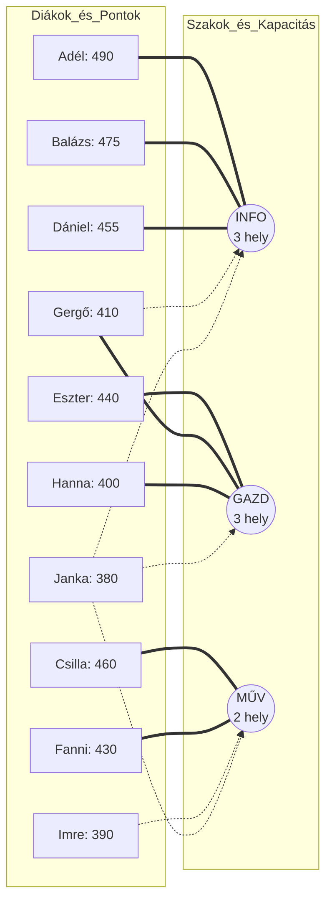

#### Az algoritmus lefutása (Lépésről lépésre)

**1. Forduló: Mindenki az 1. helyre jelentkezik**

- **INFO (3 hely):** Adél (490), Balázs (475), Dániel (455), Gergő (410), Janka (380).
  - _Döntés:_ Adél, Balázs és Dániel „ideiglenesen felvéve”. Gergő és Janka **elutasítva**.
- **GAZD (3 hely):** Eszter (440), Hanna (400).
  - _Döntés:_ Mindketten „ideiglenesen felvéve” (maradt 1 szabad hely).
- **MŰV (2 hely):** Csilla (460), Fanni (430), Imre (390).
  - _Döntés:_ Csilla és Fanni „ideiglenesen felvéve”. Imre **elutasítva**.

**2. Forduló: Az elutasítottak (Gergő, Janka, Imre) a 2. helyre próbálkoznak**

- **Gergő (410)** jelentkezik a **GAZD**-ra. Mivel volt üres hely, bekerül.
- **Janka (380)** jelentkezik a **GAZD**-ra. Most már 4-en vannak (Eszter, Hanna, Gergő, Janka).
  - _Rangsor:_ Eszter (440) > Gergő (410) > Hanna (400) > Janka (380).
  - _Döntés:_ Janka **elutasítva**.
- **Imre (390)**: Nincs 2. opciója, ő sajnos kiesett a rendszerből.

**3. Forduló: Janka a 3. helyére próbálkozik**

- **Janka (380)** jelentkezik a **MŰV**-re. Ott Csilla (460) és Fanni (430) van bent.
  - _Döntés:_ Janka pontszáma alacsonyabb, így a MŰV is **elutasítja**.

---

#### Végeredmény és Ponthatárok

| Szak     | Felvett diákok       | Ponthatár (Minimum) |
| :------- | :------------------- | :------------------ |
| **INFO** | Adél, Balázs, Dániel | **455 pont**        |
| **GAZD** | Eszter, Gergő, Hanna | **400 pont**        |
| **MŰV**  | Csilla, Fanni        | **430 pont**        |

**Kimaradt:** Imre (390), Janka (380).

#### Konklúzió

A feladat jól mutatja, hogy a Gale-Shapley algoritmus hogyan alakítja ki a **ponthatárokat**. Például Hanna bejutott a GAZD-ra 400 ponttal, mert volt helye, míg Csilla 460 ponttal „erősebb” volt nála, de ő a MŰV-et választotta, ahol magasabb (430) lett a ponthatár. A rendszer stabil: senki nem tudna olyat mutatni, akinek kevesebb pontja van, de bejutott egy olyan helyre, ahová ő is vágyott.

```js
function assignStudentsToUniversities(students, programs) {
  // 1. Előkészítés
  let freeStudents = [...students];
  let admissions = {}; // szak_nev -> [felvett_diakok_listaja]

  programs.forEach((p) => (admissions[p.name] = []));

  // 2. Az algoritmus futtatása
  while (freeStudents.length > 0) {
    let student = freeStudents.shift();

    // Ha a diáknak nincs több megjelölt szaka, kiesik
    if (student.prefs.length === 0) continue;

    // Következő megjelölt szak lekérése
    let targetProgramName = student.prefs.shift();
    let program = programs.find((p) => p.name === targetProgramName);

    let currentAdmitted = admissions[targetProgramName];

    // Ideiglenesen felvesszük a diákot
    currentAdmitted.push(student);

    // Rangsoroljuk a jelentkezőket pontszám szerint (csökkenő)
    currentAdmitted.sort((a, b) => b.score - a.score);

    // Ha túlléptük a keretszámot, a leggyengébb kiesik
    if (currentAdmitted.length > program.capacity) {
      let rejectedStudent = currentAdmitted.pop();
      freeStudents.push(rejectedStudent);
    }
  }

  // 3. Eredmények formázása és ponthatárok számítása
  const finalResults = {};
  for (let progName in admissions) {
    let admitted = admissions[progName];
    finalResults[progName] = {
      students: admitted.map((s) => `${s.name} (${s.score})`),
      minScore:
        admitted.length > 0 ? admitted[admitted.length - 1].score : "N/A",
    };
  }

  return finalResults;
}

// --- Adatok bevitele ---
const students = [
  { name: "Adél", score: 490, prefs: ["INFO", "GAZD"] },
  { name: "Balázs", score: 475, prefs: ["INFO", "GAZD"] },
  { name: "Csilla", score: 460, prefs: ["MŰV", "INFO"] },
  { name: "Dániel", score: 455, prefs: ["INFO", "GAZD"] },
  { name: "Eszter", score: 440, prefs: ["GAZD", "MŰV"] },
  { name: "Fanni", score: 430, prefs: ["MŰV", "GAZD"] },
  { name: "Gergő", score: 410, prefs: ["INFO", "GAZD", "MŰV"] },
  { name: "Hanna", score: 400, prefs: ["GAZD", "INFO"] },
  { name: "Imre", score: 390, prefs: ["MŰV"] },
  { name: "Janka", score: 380, prefs: ["INFO", "GAZD", "MŰV"] },
];

const programs = [
  { name: "INFO", capacity: 3 },
  { name: "GAZD", capacity: 3 },
  { name: "MŰV", capacity: 2 },
];

// --- Futtatás és kiíratás ---
const results = assignStudentsToUniversities(students, programs);

console.log("=== FELVÉTELI EREDMÉNYEK ===");
for (let prog in results) {
  console.log(`\nSzak: ${prog}`);
  console.log(`Ponthatár: ${results[prog].minScore}`);
  console.log(`Felvettek: ${results[prog].students.join(", ")}`);
}
```

```log
=== FELVÉTELI EREDMÉNYEK ===

Szak: INFO
Ponthatár: 455
Felvettek: Adél (490), Balázs (475), Dániel (455)

Szak: GAZD
Ponthatár: 400
Felvettek: Eszter (440), Gergő (410), Hanna (400)

Szak: MŰV
Ponthatár: 430
Felvettek: Csilla (460), Fanni (430)
```

## Scarf algoritmus

## Scarf-algoritmus: Elméleti áttekintés

A Scarf-algoritmus (Herbert Scarf, 1967) egy alapvető matematikai eljárás a játékelméletben és a gazdasági modellezésben. Elsődleges célja **egyensúlyi pontok** (például a mag – _core_) létezésének bizonyítása és megkeresése olyan komplex rendszerekben, ahol a hagyományos piaci mechanizmusok nem feltétlenül működnek.

### Alapvetés

Az algoritmus a stabil párosítások (Gale-Shapley) és a Sperner-lemma közötti kapcsolatot használja ki. Míg a Gale-Shapley páros gráfokon dolgozik, Scarf eljárása alkalmas **n-személyes játékok** és **oszthatatlan javak** (pl. házcsere, szervátültetés) elemzésére is.

---

### Működési elv

Az algoritmus egy kombinatorikus keresési folyamat, amely egy speciális mátrixszerkezetet (Scarf-mátrix) használ.

1.  **Preferenciák leírása:** Minden résztvevőhöz egy vektort és egy preferenciarangsort rendelünk.
2.  **Bázis-csere (Pivoting):** Hasonlóan a szimplex módszerhez, az algoritmus pontról pontra halad egy szubszimplexen keresztül.
3.  **Domináns halmaz keresése:** A folyamat olyan pontot keres, amely "kiegyensúlyozott" (balanced). Ez azt jelenti, hogy nem létezik olyan koalíció, amelynek tagjai egymás között jobban járnának, mint az aktuális felosztással.

### A Scarf-lemma jelentősége

A lemma kimondja, hogy minden olyan játékban, amely rendelkezik egy bizonyos technikai tulajdonsággal (komprehenzivitás és "balancedness"), létezik **nem üres mag**. Ez garantálja, hogy a rendszerben kialakítható egy stabil állapot.

### Gyakorlati alkalmazások

A Scarf-algoritmus elméleti alapjai vezettek a modernebb **mechanizmus tervezési** (mechanism design) eljárásokhoz:

- **Házcsere-problémák (Housing Market):** Ahol a résztvevők saját javaikat cserélik el egymás között pénzhasználat nélkül.
- **Vese-csere programok:** A Scarf-algoritmus általánosításai (pl. TTC - Top Trading Cycles) segítettek a donor-láncok stabil kialakításában.
- **Oszthatatlan javak elosztása:** Amikor a tárgyak nem darabolhatóak, és a piaci ár nem határozható meg könnyen.

---

### Összehasonlítás a Gale-Shapley-vel

| Szempont         | Gale-Shapley                         | Scarf-algoritmus                  |
| :--------------- | :----------------------------------- | :-------------------------------- |
| **Gráftípus**    | Páros gráf (pl. férfi-nő, diák-szak) | Általános hálózat / n-személyes   |
| **Erőforrás**    | Hozzárendelés (Matching)             | Csere és koalíciók (Core)         |
| **Kimenet**      | Stabil párosítás                     | Egyensúlyi pont (Core)            |
| **Bonyolultság** | Alacsony (lineáris/polinomiális)     | Magasabb (kombinatorikus keresés) |

> **Megjegyzés:** A Scarf-algoritmus jelentősége abban áll, hogy matematikai garanciát ad a stabilitásra olyan helyzetekben is, ahol a piaci verseny önmagában káoszhoz vezetne.

A Scarf-algoritmus legszemléletesebb gyakorlati példája a **lakáscsere-piac** (Housing Market), ahol nincs pénzmozgás, csak közvetlen csere, és a javak (lakások) oszthatatlanok.

### Körkörös lakáscsere

### A szituáció

Három tulajdonos (**A, B, C**) egy-egy lakással rendelkezik (**L1, L2, L3**). Mindhárman szeretnének elköltözni, de csak egymás között tudnak cserélni. A cél egy olyan csere-párosítás (vagy kör) kialakítása, amely a **magban (core)** van – azaz senki nem tudna egy másik alcsoporttal (koalícióval) jobban járni, mint a kapott eredménnyel.

### Adatok

**1. Kezdeti állapot (Tulajdonjog):**

- **A** tulajdona: **L1**
- **B** tulajdona: **L2**
- **C** tulajdona: **L3**

**2. Preferencialisták (Rangsor):**

| Tulajdonos | 1. választás | 2. választás | 3. választás |
| :--------- | :----------- | :----------- | :----------- |
| **A**      | L2           | L3           | L1           |
| **B**      | L3           | L1           | L2           |
| **C**      | L1           | L2           | L3           |

---

### A megoldás menete (Scarf/Top Trading Cycles elve alapján)

Az algoritmus keresi a "domináns köröket":

1.  **Igények jelzése:**

    - **A** rámutat **L2**-re (B lakása).
    - **B** rámutat **L3**-re (C lakása).
    - **C** rámutat **L1**-re (A lakása).

2.  **Kör azonosítása:**

    - Kialakult egy teljes kör: **A → L2(B) → L3(C) → L1(A)**.

3.  **Végrehajtás:**
    - A kör mentén mindenki megkapja az általa mutatott lakást, és elhagyják a piacot.

#### Végeredmény

- **A** megkapja **L2**-t.
- **B** megkapja **L3**-at.
- **C** megkapja **L1**-et.

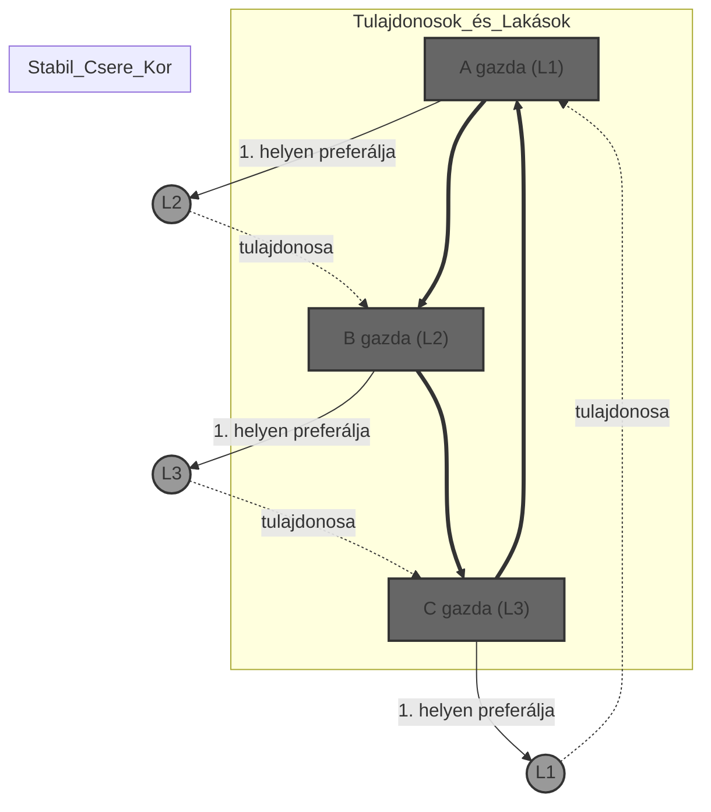

#### Miért ez a Scarf-egyensúly?

- **Egyéni racionalitás:** Mindenki jobb (vagy nem rosszabb) lakást kapott, mint a sajátja.
- **Koalíciós stabilitás:** Vegyük például **A**-t és **B**-t. Összeállhatnának ketten? Ha **A** és **B** cserélne, **A** megkapná **L2**-t (ez neki jó), de **B** megkapná **L1**-et. Viszont **B**-nek az **L1** csak a második legjobb opció, és tudja, hogy a teljes körben (C-vel együtt) megkaphatja az **L3**-at, ami az első helyen van nála. Tehát **B**-nek nem éri meg kiválni a hármas körből.

#### Mi történne, ha nem lenne kör?

Ha a preferenciák olyanok lennének, hogy nem alakul ki ilyen tiszta kör (pl. mindenki ugyanazt az egy lakást akarja), a Scarf-algoritmus akkor is garantálja egy olyan állapot megtalálását, ahol egyetlen csoport (koalíció) sem tudna "lázadni" és egymás között jobb üzletet kötni.

#### Mi a különbség a Gale-Shapley-hez képest ebben a feladatban?

- Itt **nincsenek külön oldalak** (mint férfiak és nők). Mindenki egyszerre "kínáló" (van lakása) és "kereső" (akar egy lakást).
- A Scarf-algoritmus az **oszthatatlanságot** és a **tulajdonjogot** kezeli egyszerre, biztosítva, hogy a csere után senki ne érezze úgy, hogy a saját tulajdonát használva jobban is járhatott volna.

#### Kód

```js
/**
 * Scarf-típusú lakáscsere algoritmus (TTC)
 * Tulajdonosok: A, B, C
 * Lakások: L1, L2, L3
 */
function stabilLakasCsere(adatok) {
  let piac = [...adatok];
  let eredmeny = [];

  while (piac.length > 0) {
    let mutatasok = new Map();

    // 1. Mindenki rámutat a kedvenc elérhető lakásának jelenlegi gazdájára
    piac.forEach((szemely) => {
      let kedvencLakas = szemely.preferenciak.find((l) =>
        piac.some((p) => p.sajatLakas === l)
      );

      let gazda = piac.find((p) => p.sajatLakas === kedvencLakas);
      mutatasok.set(szemely.nev, gazda.nev);
    });

    // 2. Kör keresése (Scarf-lemma alapján garantáltan van ilyen)
    let kor = [];
    let bejart = new Set();
    let aktualis = piac[0].nev;

    while (!bejart.has(aktualis)) {
      bejart.add(aktualis);
      aktualis = mutatasok.get(aktualis);
    }

    let startNode = aktualis;
    do {
      kor.push(aktualis);
      aktualis = mutatasok.get(aktualis);
    } while (aktualis !== startNode);

    // 3. A körben résztvevők megkapják az igényelt lakást és kilépnek
    kor.forEach((nev) => {
      let szemely = piac.find((p) => p.nev === nev);
      let kitolKapjaNev = mutatasok.get(nev);
      let kitolKapja = piac.find((p) => p.nev === kitolKapjaNev);

      eredmeny.push({
        tulajdonos: szemely.nev,
        kapottLakas: kitolKapja.sajatLakas,
      });
    });

    // Piac frissítése: a kör tagjai elmennek
    piac = piac.filter((p) => !kor.includes(p.nev));
  }

  return eredmeny;
}

// --- Adatok az eredeti feladatleírás alapján ---
const adatok = [
  { nev: "A", sajatLakas: "L1", preferenciak: ["L2", "L3", "L1"] },
  { nev: "B", sajatLakas: "L2", preferenciak: ["L3", "L1", "L2"] },
  { nev: "C", sajatLakas: "L3", preferenciak: ["L1", "L2", "L3"] },
];

// --- Végrehajtás ---
const veglegesParositas = stabilLakasCsere(adatok);

console.log("=== SCARF-EGYENSÚLYI EREDMÉNY ===");
veglegesParositas.forEach((p) => {
  console.log(`${p.tulajdonos} tulajdonos megkapta: ${p.kapottLakas}`);
});
```

```log
=== SCARF-EGYENSÚLYI EREDMÉNY ===
A tulajdonos megkapta: L2
B tulajdonos megkapta: L3
C tulajdonos megkapta: L1
```

## $\Delta-Y$ transzformáció és gráfredukció

Az elektromos hálózatok gráfelméleti modelljében a bonyolult ellenállás-hálózatok egyszerűsítésére szolgáló módszer. A cél a gráf méretének csökkentése az eredő ellenállás megőrzése mellett.

### A $\Delta-Y$ transzformáció

Egy háromszög ($K_3$) alakú elrendezés helyettesíthető egy csillag ($K_{1,3}$) alakú elrendezéssel.

- **$\Delta$ (delta):** Három csomópont ($i, j, k$) közötti élek ellenállásai: $R_{ij}, R_{jk}, R_{ik}$.
- **$Y$ (csillag):** Egy új belső pont ($\ell$) és a csomópontok közötti ágak ellenállása.
- **Képlet (példa):** Az $i$ ponthoz csatlakozó új ellenállás:
  $$R_{i\ell} = \frac{R_{ij} \cdot R_{ik}}{R_{ij} + R_{jk} + R_{ik}}$$

### Soros-párhuzamos redukciós lépések

A $\Delta-Y$ transzformáció mellett az alábbi alapműveletek (R0–R3) segítik a gráf redukálását:

- **R0 (Huroktörlés):** Önhurok (egy pontba visszatérő él) eltávolítása.
- **R1 (Levél törlése):** Elsőfokú pont és a hozzá tartozó él törlése.
- **R2 (Soros redukció):** Másodfokú pont törlése; a két csatlakozó élet egyetlen, az ellenállások összegével jellemezhető élre cseréljük.
- **R3 (Párhuzamos redukció):** Két pont közötti párhuzamos élek helyettesítése egyetlen éllel.

### $\Delta-Y$-redukálhatóság

Egy gráfosztály akkor **$\Delta-Y$-redukálható**, ha a fenti transzformációk és redukciók sorozatos alkalmazásával a gráf mérete folyamatosan csökkenthető.

- **Terminális pontok:** Az eljárás végén megmaradó csomópontok, amelyeket a fenti szabályokkal már nem lehet tovább törölni vagy redukálni.
- **Jelentősége:** Segít meghatározni, hogy egy hálózat elemi úton kiszámítható-e, vagy komplexebb mátrixos módszereket igényel.

### Hídkapcsolat eredő ellenállása

Határozzuk meg az **A** és **B** pontok közötti eredő ellenállást egy olyan hídkapcsolásban (Wheatstone-híd), ahol minden ág ellenállása $R = 120\ \Omega$. A hálózat nem redukálható pusztán soros vagy párhuzamos szabályokkal.

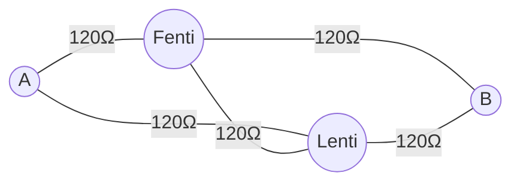

#### Megoldás $\Delta-Y$ transzformációval

1.  **$\Delta \rightarrow Y$ átalakítás:** A bal oldali háromszöget ($A$ pont + híd két vége) csillaggá alakítjuk. Az új ágak ellenállása ($R_y$):
    $$R_y = \frac{120 \cdot 120}{120 + 120 + 120} = \mathbf{40\ \Omega}$$

2.  **Soros redukció (R2):** A csillagpont utáni ágakban az új $40\ \Omega$-os és a megmaradt eredeti $120\ \Omega$-os ellenállások sorba kerülnek:
    $$R_{ág} = 40 + 120 = \mathbf{160\ \Omega}$$

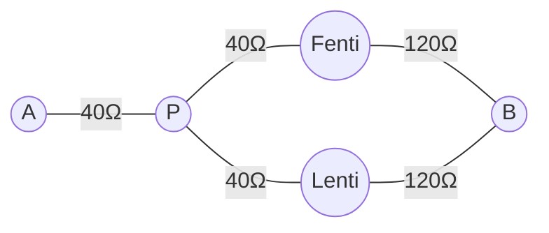

3.  **Párhuzamos redukció (R3):** A két párhuzamos $160\ \Omega$-os ág eredője:
    $$R_p = \frac{160 \cdot 160}{160 + 160} = \mathbf{80\ \Omega}$$

4.  **Végső összegzés:** A bemeneti $40\ \Omega$ és a párhuzamos rész eredője soros:
    $$R_{eredő} = 40 + 80 = \mathbf{120\ \Omega}$$

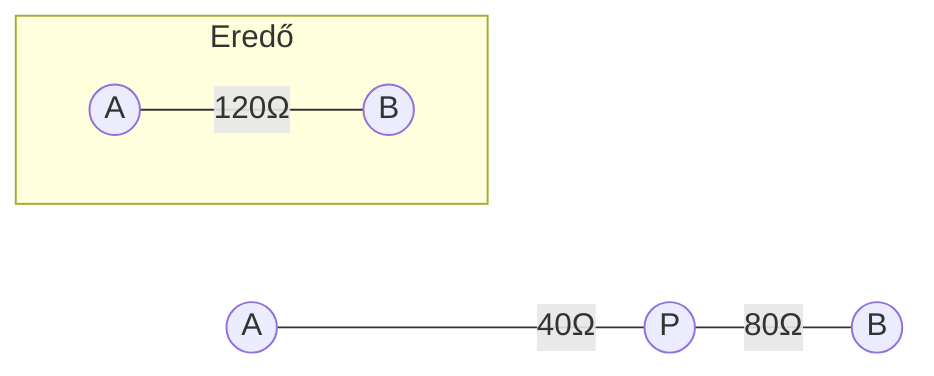

#### Összegző táblázat a redukcióról

| Lépés | Alkalmazott szabály           | Eredmény                                        |
| :---- | :---------------------------- | :---------------------------------------------- |
| 1.    | **$\Delta-Y$ transzformáció** | A hurok megszűnik, belső csomópont jön létre.   |
| 2.    | **R2 (Soros)**                | Az ágakban lévő ellenállások összeadódnak.      |
| 3.    | **R3 (Párhuzamos)**           | A két ág egyetlen eredőre egyszerűsödik.        |
| 4.    | **R2 (Soros)**                | Megkapjuk a két terminál közötti végső értéket. |

#### Kód

```js
/**
 * Ellenállás-hálózat redukáló (Delta-Y fókusszal)
 */
class HalozatRedukalo {
  // Delta-Y transzformáció: R1, R2, R3 (delta élek) -> Ry (csillag ellenállás)
  static deltaToWye(r1, r2, r3) {
    const sum = r1 + r2 + r3;
    return {
      ra: (r1 * r2) / sum,
      rb: (r1 * r3) / sum,
      rc: (r2 * r3) / sum,
    };
  }

  // R3: Párhuzamos redukció
  static parhuzamos(r1, r2) {
    return (r1 * r2) / (r1 + r2);
  }

  // R2: Soros redukció
  static soros(r1, r2) {
    return r1 + r2;
  }
}

// --- A konkrét feladat megoldása ---

console.log("--- Hídkapcsolás redukciója ---");

const R = 120; // Minden ellenállás 120 Ohm

// 1. Lépés: Bal oldali Delta (A-F-L csúcsok) -> Y transzformáció
// Mivel minden R egyenlő, az új ágak is egyenlőek lesznek
const yAgak = HalozatRedukalo.deltaToWye(R, R, R);
console.log(`1. Delta-Y utáni új ágak: ${yAgak.ra} Ω`);

// 2. Lépés: Soros redukció az ágakban (P-F-B és P-L-B útvonalak)
// Az Y két ága sorba kerül a maradék két eredeti ellenállással
const felsoAg = HalozatRedukalo.soros(yAgak.rb, R);
const alsoAg = HalozatRedukalo.soros(yAgak.rc, R);
console.log(`2. Soros ágak értéke: ${felsoAg} Ω`);

// 3. Lépés: Párhuzamos redukció a két ág között
const parhuzamosEredo = HalozatRedukalo.parhuzamos(felsoAg, alsoAg);
console.log(`3. Párhuzamos rész eredője: ${parhuzamosEredo} Ω`);

// 4. Lépés: Utolsó soros elem (A ponttól induló Y szár)
const vegsoEredo = HalozatRedukalo.soros(yAgak.ra, parhuzamosEredo);

console.log("\n--------------------------------");
console.log(`VÉGEREDMÉNY: ${vegsoEredo} Ω`);
console.log("--------------------------------");
```

```log
--- Hídkapcsolás redukciója ---
1. Delta-Y utáni új ágak: 40 Ω
2. Soros ágak értéke: 160 Ω
3. Párhuzamos rész eredője: 80 Ω

--------------------------------
VÉGEREDMÉNY: 120 Ω
--------------------------------
```

## Tiltott részgráfokkal jellemzett osztályok

A gráfelmélet egyik legfontosabb megközelítése a gráfosztályok definíciója nem tulajdonságok (pl. "összefüggő"), hanem **tiltott struktúrák** alapján. Egy gráfosztályt akkor jellemzünk tiltott részgráfokkal, ha megadjuk azoknak a gráfoknak a halmazát ($\mathcal{F}$), amelyeket a vizsgált gráf nem tartalmazhat "formációként".

### Tartalmazási relációk (Mikor "tiltott"?)

A "tartalmazás" többféleképpen értelmezhető, ami eltérő osztályokhoz vezet:

- **Részgráf (Subgraphs):** $H$ nem lehet része $G$-nek (élek elhagyásával sem).
- **Feszített részgráf (Induced Subgraphs):** $H$ nem jelenhet meg úgy, hogy $G$ bizonyos pontjait és az összes közöttük futó élet megtartjuk. (Pl. a húrmentes körök vizsgálata).
- **Minor (Minors):** $H$ nem kapható meg $G$-ből éllehagyással, ponttörléssel vagy élösszehúzással. (A legmélyebb elméleti háttér).

### Nevezetes tételek és osztályok

| Gráfosztály         | Tiltott struktúra              | Megjegyzés                                                     |
| :------------------ | :----------------------------- | :------------------------------------------------------------- |
| **Erdő (Forest)**   | Körök ($C_n$)                  | Nem tartalmazhat semmilyen kört részgráfként.                  |
| **Páros gráfok**    | Páratlan körök ($C_{2k+1}$)    | Csak páros hosszúságú körök megengedettek.                     |
| **Síkgráfok**       | $K_5$ és $K_{3,3}$ minorok     | Kuratowski-tétel: ezen gráfok felosztásait nem tartalmazhatja. |
| **Perfekt gráfok**  | Páratlan lyukak és anti-lyukak | Erős perfekt gráf tétel (Berge-sejtés).                        |
| **Kordális gráfok** | $C_n$ ahol $n \ge 4$           | Feszített részgráfként nem tartalmazhat $3$-nál hosszabb kört. |

### Jellemző tulajdonságok

- **Öröklődő tulajdonság:** Ha egy osztály tiltott részgráfokkal van definiálva, akkor a tulajdonság öröklődik a részgráfokra (ha $G$ benne van, minden részgráfja is).
- **Véges vs. Végtelen bázis:** Bizonyos osztályok jellemezhetőek véges sok tiltott gráffal (pl. síkgráfok), másoknak végtelen sok tiltott eleme van (pl. páros gráfok, mert minden páratlan kör tiltott).

### A Robertson–Seymour tétel (Minor-tétel)

A gráfelmélet egyik legmélyebb eredménye. Kimondja, hogy minden olyan gráfosztály, amely zárt a minor képzésre (tehát ha $G$ benne van, minden minora is), jellemezhető **véges sok** tiltott minorral.

> **Példa:** A síkba rajzolhatóság minor-zárt tulajdonság, és a tiltott minorok halmaza véges: $\{K_5, K_{3,3}\}$.

### Regiszterallokáció (Kordális gráfok)

#### Szituáció

A fordítóprogramoknak változókat kell regiszterekhez rendelniük. Két változó között akkor van él (**interferencia**), ha egy időben aktívak. A cél a gráf színezése a lehető legkevesebb színnel (regiszterrel).

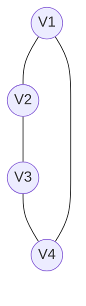

#### A tiltott részgráf szerepe

A strukturált programkódok interferencia-gráfjai általában **kordális gráfok**.

- **Definíció:** Nem tartalmaznak **húrmentes kört** ($C_n, n \geq 4$) feszített részgráfként.
- **Tiltott struktúra:** $C_4, C_5, C_6 \dots$ (hosszú "lyukak").

#### A megoldás menete és magyarázata

A feladat megoldása során nem egyszerűen csak színeket osztunk ki, hanem a gráf **topológiáját** változtatjuk meg, hogy egy matematikailag könnyebben kezelhető osztályba (a kordális gráfok közé) kerüljünk.

#### A tiltott részgráf azonosítása

A fordítóprogram első lépése a gráf feltérképezése. Amikor a változók ütközési gráfjában talál egy $C_4, C_5$ vagy hosszabb húrmentes kört (pl. $V_1-V_2-V_3-V_4-V_1$), felismeri, hogy egy **tiltott struktúrával** áll szemben.

- **A baj:** Ebben a körben bármely két nem szomszédos változó "távol" van egymástól, nincs köztük kényszer, de a kör egésze miatt az optimális színezés kiszámítása általános esetben exponenciális időt is igénybe vehetne.

#### Trianguláció (A "húr" behúzása)

A megoldás kulcsa a **trianguláció**. A program mesterségesen létrehoz egy új élt (húrt), például $V_1$ és $V_3$ között.

- **Hogyan történik ez a gyakorlatban?** A fordítóprogram úgy dönt, hogy a $V_1$ és $V_3$ változókat "összeköti" egy közös műveletben, vagy kényszeríti őket, hogy ne kerülhessenek azonos regiszterbe akkor sem, ha eredetileg nem ütköztek volna.
- **Eredmény:** A $C_4$ négyszög két $K_3$ háromszöggé válik. Ezzel a gráf **kordális** lesz.

#### Optimális sorrend (PEO) meghatározása

A kordális gráfok nagy előnye, hogy létezik hozzájuk egy **Perfect Elimination Ordering (Tökéletes Kiejtési Sorrend)**. Ez egy olyan pontsorrend, amelyben a pontokat egymás után vizsgálva a szomszédaik mindig egy "klikk"-et (teljes részgráfot) alkotnak.

#### Mohó színezés és eredmény

Miután a tiltott részgráfot megszüntettük és megvan a PEO sorrend, a **mohó algoritmus** (Greedy Coloring) lép életbe:

1. Fogja a soron következő változót.
2. Megnézi, milyen színeket (regisztereket) használnak már a szomszédai.
3. Kiosztja a legkisebb szabad sorszámú regisztert.

**A matematikai garancia:** Mivel a gráf kordális és PEO sorrendet használtunk, a mohó algoritmus **garantáltan a kromatikus számot ($\chi(G)$)** fogja eredményezni, vagyis a lehető legkevesebb regisztert használja el.

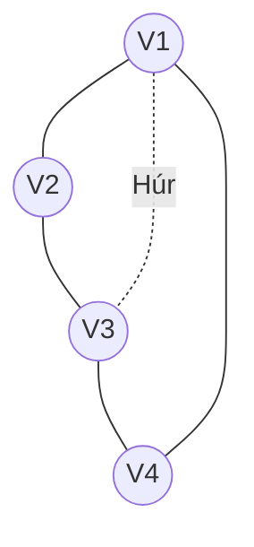

```js
/**
 * Regiszterallokáció szimuláció (Kordális vs. Nem kordális)
 */
class RegisterAllocator {
  constructor(adjacencies) {
    this.graph = adjacencies;
    this.nodes = Object.keys(adjacencies);
  }

  // Egyszerű mohó színezés
  colorGraph(order = this.nodes) {
    const result = {};

    order.forEach((node) => {
      const neighborColors = new Set(
        this.graph[node]
          .map((neighbor) => result[neighbor])
          .filter((color) => color !== undefined)
      );

      // Megkeressük a legkisebb elérhető színt (regisztert)
      let color = 0;
      while (neighborColors.has(color)) {
        color++;
      }
      result[node] = color;
    });

    return result;
  }
}

// --- 1. ESET: Tiltott részgráfot tartalmazó gráf (C4 kör: V1-V2-V3-V4-V1) ---
const forbiddenGraph = {
  V1: ["V2", "V4"],
  V2: ["V1", "V3"],
  V3: ["V2", "V4"],
  V4: ["V3", "V1"],
};

// --- 2. ESET: Kordális gráf (Ugyanez, de behúztunk egy V1-V3 húrt) ---
const chordalGraph = {
  V1: ["V2", "V4", "V3"], // +V3 húr
  V2: ["V1", "V3"],
  V3: ["V2", "V4", "V1"], // +V1 húr
  V4: ["V3", "V1"],
};

const allocatorForbidden = new RegisterAllocator(forbiddenGraph);
const allocatorChordal = new RegisterAllocator(chordalGraph);

// Színezés (Regiszterkiosztás)
const res1 = allocatorForbidden.colorGraph();
const res2 = allocatorChordal.colorGraph(["V4", "V2", "V3", "V1"]); // PEO sorrend

console.log("=== 1. Tiltott C4 kör (Nem kordális) ===");
console.log("Regiszter kiosztás:", res1);
console.log(
  "Szükséges regiszterek száma:",
  Math.max(...Object.values(res1)) + 1
);

console.log("\n=== 2. Triangulált (Kordális) gráf ===");
console.log("Regiszter kiosztás:", res2);
console.log(
  "Szükséges regiszterek száma:",
  Math.max(...Object.values(res2)) + 1
);
```

```log
=== 1. Tiltott C4 kör (Nem kordális) ===
Regiszter kiosztás: { V1: 0, V2: 1, V3: 0, V4: 1 }
Szükséges regiszterek száma: 2

=== 2. Triangulált (Kordális) gráf ===
Regiszter kiosztás: { V4: 0, V2: 0, V3: 1, V1: 2 }
Szükséges regiszterek száma: 3
```

## Források

- Jegyzet: https://www.inf.u-szeged.hu/~pluhar/oktatas/grafalg.pdf
- AI beszélgetések:
  - https://gemini.google.com/share/75742f671e1f
  - https://gemini.google.com/share/990b6ec9e47c
  - https://gemini.google.com/share/cb695c86b260
