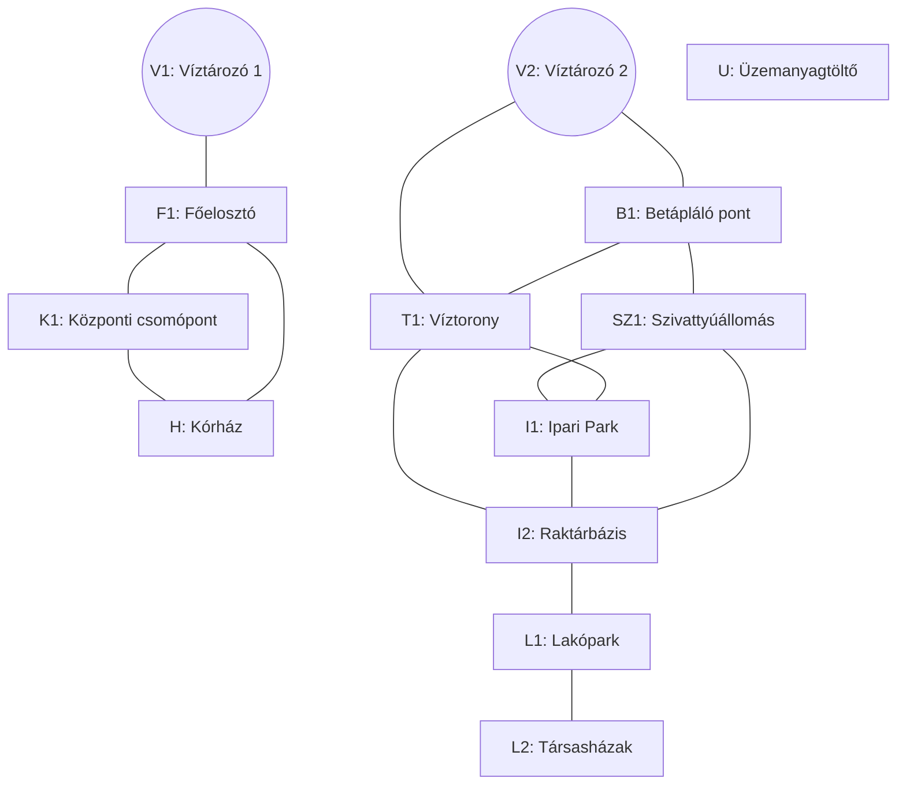

# Gráfelméleti algoritmusok

## Alapfogalmak és definíciók

A gráfelméleti vizsgálatok alapja a **gráf** precíz matematikai definíciója. Egy $G$ gráfot a $G = (V, E, I)$ rendezett hármassal definiálunk:

- **$V(G)$** jelöli a csúcsok (pontok) halmazát.
- **$E(G)$** jelöli az élek halmazát.
- **$I(G)$** az incidencia függvény, amely minden egyes élhez hozzárendeli annak végpontjait (egy- vagy kételemű halmazként).

A definíció megengedi a **hurokélek** (olyan élek, melyeknek végpontjai egybeesnek) és a **többszörös élek** jelenlétét is.

### Csúcsok fokszáma

Egy $v$ csúcs **fokszáma** ($d(v)$) az rá illeszkedő élek száma. Fontos konvenció, hogy hurokél esetén az adott élet kétszeresen számítjuk bele a fokszámba. Irányított gráfoknál megkülönböztetünk **befutó** ($d^-(v)$) és **kifutó** ($d^+(v)$) fokszámot; ezek összege adja a csúcs teljes fokszámát ($d(v) = d^-(v) + d^+(v)$).

### Séta, út és kör

A gráfban való haladás leírására a következő szekvenciákat alkalmazzuk:

- **Séta:** Csúcsok és élek olyan sorozata, ahol minden él az őt megelőző és követő csúcsot köti össze.
- **Út:** Olyan séta, amelyben minden érintett csúcs különböző.
- **Kör:** Olyan zárt séta, amelyben az első és utolsó csúcs megegyezik, de a többi csúcs különböző.

---

## Fák

A fák a gráfelmélet egyik legfontosabb osztályát alkotják, mivel ezek reprezentálják a legegyszerűbb összefüggő struktúrákat.

### A fa definíciója és ekvivalens jellemzései

Egy gráfot **fának** nevezünk, ha összefüggő és körmentes. Egy $n$ pontú $G$ gráf esetén az alábbi állítások mindegyike ekvivalens:

- $G$ fa (összefüggő és körmentes).
- $G$ összefüggő, de tetszőleges élét elhagyva az összefüggőség megszűnik (**minimálisan összefüggő**).
- $G$ körmentes, de tetszőleges új éllel bővítve kör keletkezik benne (**maximálisan körmentes**).
- $G$ összefüggő és pontosan $n-1$ éle van.
- $G$ körmentes és pontosan $n-1$ éle van.

### Strukturális tulajdonságok

A fák szerkezetéből adódóan bizonyítható, hogy bármely két $x, y$ csúcspár között **pontosan egy út** vezet. Ebből következik, hogy a fák nem tartalmaznak redundáns kapcsolatokat.

Szintén alapvető tulajdonság, hogy minden legalább két pontból álló fának van legalább két **levele** (elsődleges, azaz egyfokú pontja). Ez a tulajdonság teszi lehetővé a fákra vonatkozó legtöbb tétel teljes indukcióval történő bizonyítását.

### Feszítőfák és gyökeres fák

- **Feszítőfa:** Egy $G$ gráf olyan $T$ részgráfja, amely fa és tartalmazza $G$ összes csúcsát ($V(T) = V(G)$).
- **Gyökeres fa:** Olyan fa, melyben kijelölünk egy kitüntetett $r$ csúcsot (gyökér). Ez a pont egy egyértelmű irányítást ad a fának: minden él kezdőpontja az $r$-hez közelebbi csúcs lesz.

---

## Gráfok összefüggősége és komponensei

A gráfok belső szerkezetének elemzésekor alapvető kérdés az elérhetőség. Ez a fejezet az elérhetőség különböző szintjeit és azok vizsgálatát tárgyalja.

### Elméleti alapvetések

#### Irányítatlan gráfok összefüggősége

Egy $G$ gráfot **összefüggőnek** nevezünk, ha tetszőleges $x, y \in V(G)$ csúcspár között létezik út. Amennyiben a gráf nem összefüggő, az elérhetőség alapján különálló részekre bontható.

Vezessük be az $x \sim y$ relációt, amely azt fejezi ki, hogy az $x$ és $y$ pontok között van út. Ez egy **ekvivalenciareláció** (reflexív, szimmetrikus és tranzitív). Az általa meghatározott ekvivalenciaosztályokat a gráf **komponenseinek** nevezzük.

#### Irányított gráfok összefüggősége

Irányított gráfok esetén az élek iránya miatt két szintet különböztetünk meg:

- **Gyenge összefüggőség:** Az irányított gráf gyengén összefüggő, ha az élek irányítását elhagyva a kapott alapgráf összefüggő.
- **Erős összefüggőség:** A gráf erősen összefüggő, ha bármely két $x, y$ pontja között létezik **irányított út** mindkét irányban ($x \to y$ és $y \to x$).

Az oda-vissza irányított elérhetőség ($x \equiv y$) szintén ekvivalenciareláció, melynek osztályai az **erősen összefüggő komponensek**.

---

### Algoritmusok a gyenge összefüggőség vizsgálatára

A gyenge összefüggőség eldöntése visszavezethető az irányítatlan gráfok összefüggőségének vizsgálatára az élek irányának figyelmen kívül hagyásával.

#### Szélességi keresés (BFS) alapú megközelítés

```text
ALGORITMUS GyengeÖsszefüggőségBFS(G):
    Látogatott = [Hamis, ..., Hamis] (n elemű tömb)
    Várólista = Üres sor (Queue)
    Válasszunk egy tetszőleges s csúcsot
    Látogatott[s] = Igaz
    Várólista.betesz(s)
    Számláló = 1

    AMÍG Várólista NEM üres:
        u = Várólista.kivesz()
        MINDEN v szomszédra (ahol (u,v) ∈ E VAGY (v,u) ∈ E):
            HA Látogatott[v] == Hamis:
                Látogatott[v] = Igaz
                Várólista.betesz(v)
                Számláló = Számláló + 1
    VISSZAAD (Számláló == n)
```

#### Mélységi keresés (DFS) alapú megközelítés

```text
ALGORITMUS GyengeÖsszefüggőségDFS(G):
    Látogatott = [Hamis, ..., Hamis]
    Számláló = 0
    ELJÁRÁS Bejár(u):
        Látogatott[u] = Igaz
        Számláló = Számláló + 1
        MINDEN v szomszédra (ahol (u,v) ∈ E VAGY (v,u) ∈ E):
            HA Látogatott[v] == Hamis:
                Bejár(v)
    Bejár(tetszőleges s kezdőcsúcs)
    VISSZAAD (Számláló == n)
```

---

### Erős összefüggőség és a Tarjan-algoritmus

Az erős összefüggőség vizsgálata során az élek irányítása kötött. Ennek meghatározására hatékony, DFS-alapú algoritmusokat használunk.

#### A Tarjan-algoritmus elve

A Tarjan-algoritmus egyetlen bejárás alatt azonosítja az összes erősen összefüggő komponenst (SCC). Két értéket követ:

- **Index:** Felfedezési sorrend.
- **Lowlink:** A legkisebb indexű csúcs, amely az adott pontból (akár hátraszúró élen) elérhető.

#### A Tarjan-algoritmus pszeudokódja

```text
ALGORITMUS TarjanSCC(G):
    Számláló = 0
    Verem = Üres verem
    Eredmény = []
    MINDEN v csúcsra: v.index = -1, v.veremben_van = Hamis

    ELJÁRÁS ErősBejár(u):
        u.index = u.lowlink = Számláló++
        Verem.push(u)
        u.veremben_van = Igaz
        MINDEN (u, v) ∈ E élre:
            HA v.index == -1:
                ErősBejár(v)
                u.lowlink = MIN(u.lowlink, v.lowlink)
            ELÁGAZÁS HA v.veremben_van:
                u.lowlink = MIN(u.lowlink, v.index)
        HA u.lowlink == u.index:
            ÚjSCC = []
            CIKLUS:
                w = Verem.pop(); w.veremben_van = Hamis
                ÚjSCC.hozzáad(w)
                AMÍG w != u
            Eredmény.hozzáad(ÚjSCC)

    MINDEN v csúcsra: HA v.index == -1: ErősBejár(v)
    VISSZAAD Eredmény
```

#### Komplexitás és jellemzők

- **Időigény:** $O(V + E)$, mivel minden csúcsot és élet pontosan egyszer vizsgál meg.
- **Tárigény:** $O(V)$ a verem és az állapotok tárolása miatt.

### Alkalmazási példa: Infrastrukturális hálózat összefüggőségének vizsgálata

#### Feladat:

Az alábbi gráfon egy város vízeloszlását látjuk. Kettő forrásunk van, V1 és V2 víztározók.

A feladat, hogy meghatározzuk a város mely pontjaiba jut el a V1 és a V2 víztározókból víz, illetve, van-e olyan pont, ahova nem jut el.

#### Példa gráf:



#### A megoldás menete

(Gyengén) Összefüggő komponenseket fogunk keresni, V1, V2 csúcsokból kiindulva, illetve nyilvántartjuk, mely csúcsokat nem láttuk még egy halmazban. Az algoritmus futásának végén, ezen halmaz elemei fogják megmondani, mely csúcsok nem kapnak jelenleg sehonnan vizet.

Meglátogatlan csúcsok:

```
{ V1, V2, U, F1, B1, K1, T1, SZ1, H, I1, I2, L1, L2 }
```

1. Bejárás: V1 víztározó hatóköre

| Iteráció | Aktuális csúcs ($u$) | Open halmaz (Queue) | Closed halmaz (Látogatott) | Esemény / Észrevétel                      |
| :------- | :------------------- | :------------------ | :------------------------- | :---------------------------------------- |
| **0.**   | -                    | `[V1]`              | `{V1}`                     | V1-ből indulunk.                          |
| **1.**   | **V1**               | `[F1]`              | `{V1, F1}`                 | F1 elérése.                               |
| **2.**   | **F1**               | `[K1, H]`           | `{V1, F1, K1, H}`          | K1 és H felfedezése.                      |
| **3.**   | **K1**               | `[H]`               | `{V1, F1, K1, H}`          | H már a sorban van, nem adjuk hozzá újra. |
| **4.**   | **H**                | `[]`                | `{V1, F1, K1, H}`          | Sor üres. **V1 körzete: {V1, F1, K1, H}** |

Meglátogatlan csúcsok:

```
{ V2, U, B1, T1, SZ1, I1, I2, L1, L2 }
```

2. Bejárás: A V2 víztározó ellátási körzete

| Iteráció | Aktuális csúcs ($u$) | Open halmaz (Queue) | Closed halmaz (Látogatott)  | Esemény / Észrevétel                      |
| :------- | :------------------- | :------------------ | :-------------------------- | :---------------------------------------- |
| **0.**   | -                    | `[V2]`              | `{V2}`                      | Új mérés indítása a V2 forrásból.         |
| **1.**   | **V2**               | `[B1, T1]`          | `{V2, B1, T1}`              | B1 és T1 bekerül a sorba.                 |
| **2.**   | **B1**               | `[T1, SZ1]`         | `{V2, B1, T1, SZ1}`         | T1 már sorban van, SZ1 új elem.           |
| **3.**   | **T1**               | `[SZ1, I1, I2]`     | `{V2, B1, T1, SZ1, I1, I2}` | T1-ből I1 és I2 is elérhető.              |
| **4.**   | **SZ1**              | `[I1, I2]`          | `{V2, B1, T1, SZ1, I1, I2}` | I1 és I2 már ismertek, nincs változás.    |
| **5.**   | **I1**               | `[I2]`              | `{V2, B1, T1, SZ1, I1, I2}` | Minden szomszéd (SZ1, T1, I2) látogatott. |
| **6.**   | **I2**               | `[L1]`              | `{V2..I2, L1}`              | Az I2 ponton keresztül elérjük az L1-et.  |
| **7.**   | **L1**               | `[L2]`              | `{V2..L1, L2}`              | L2 (Társasházak) bekerül a sorba.         |
| **8.**   | **L2**               | `[]`                | `{V2..L2}`                  | A sor kiürült. **V2 körzete kész.**       |

- Konklúzió:

  - V1 által ellátott pontok: { V1, F1, K1, H }
  - V2 által ellátott pontok: { V2, B1, T1, SZ1, I1, I2, L1, L2 }
  - Víz nélküli pontok: { U }
